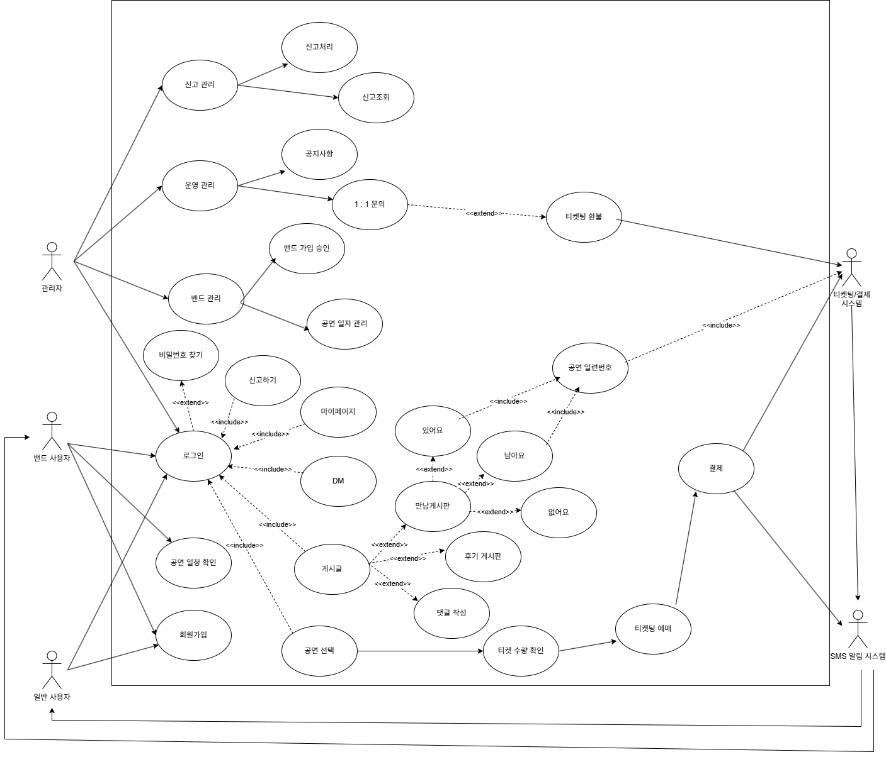
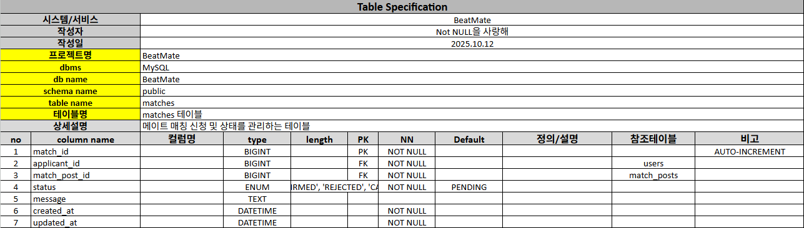
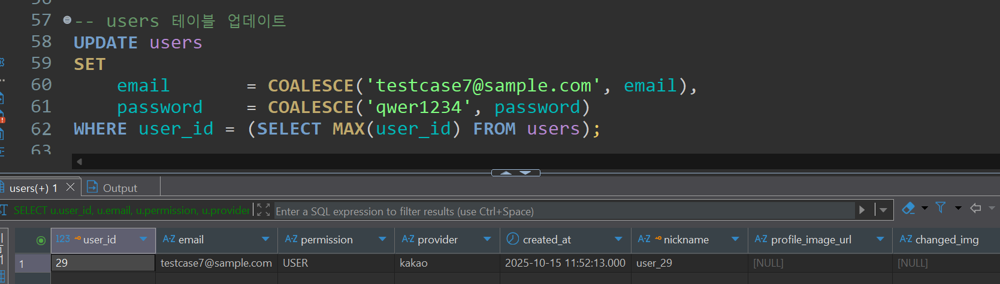
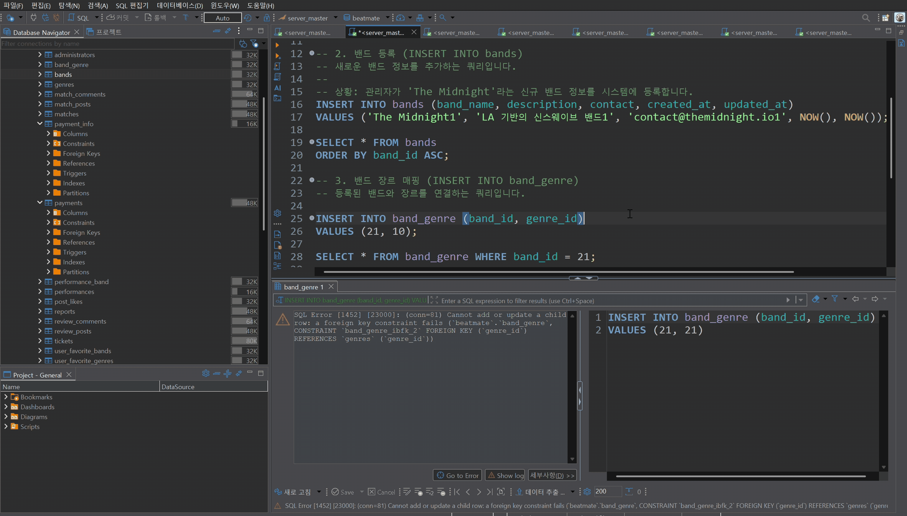
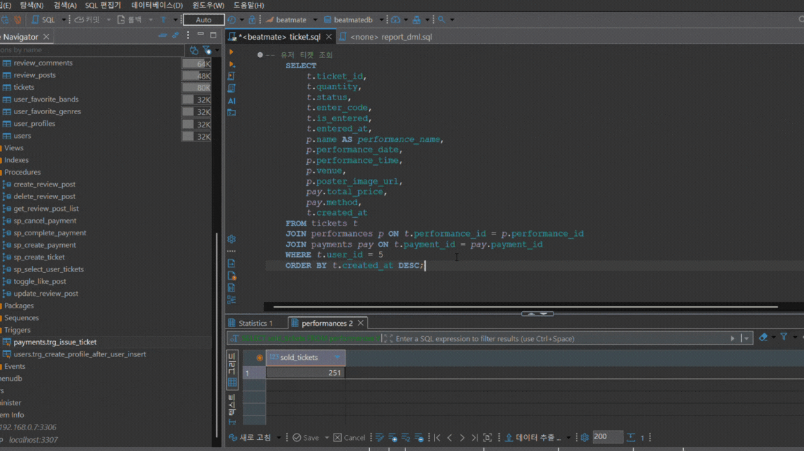
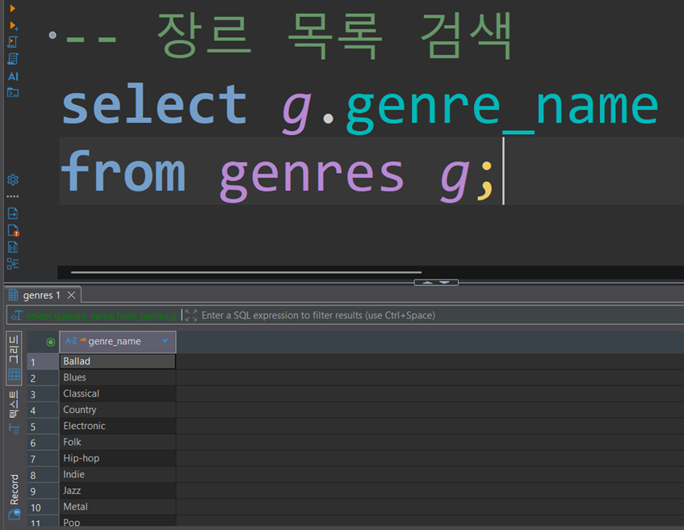
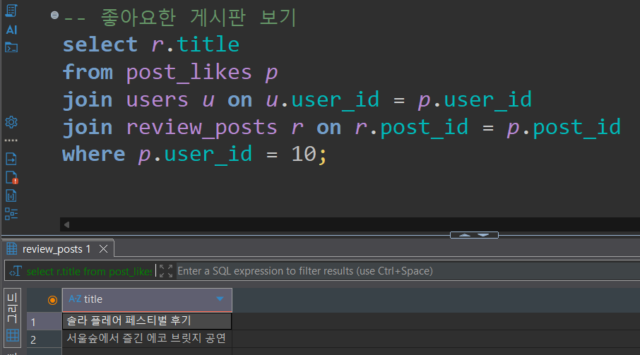

<!-- <div align="center">
  <h1>🎶<b>BeatMate</b>, 인디 공연 동행의 시작</h1>
  
</div> -->
<div align="center">
  
  <h1 style="color:#2F5D7B;">더 가깝게, 더 쉽게, 더 신나게</h1>
  <p style="font-size:1.2em; color:#555;">
    당신의 완벽한 콘서트 파트너, BeatMate와 함께 <br>
    인디밴드 공연의 모든 것을 경험하세요!
  </p>
</div>

<div align="center">
  <h2> 👥'Not Null을 사랑해' 조원 </h2>
  <table border="0" style="border: none; width: 80%;">
    <tr>
      <td align="center">
        
        <br />
        <b>송형욱</b>
        <br />
        <a href="https://github.com/haengguk">@haengguk</a>
      </td>
      <td align="center">
        
        <br />
        <b>임재열</b>
        <br />
        <a href="https://github.com/Jae-yeol1">@PPoTTO_Meow</a>
      </td>
      <td align="center">
        
        <br />
        <b>이관호</b>
        <br />
        <a href="https://github.com/Apeirogon99">@Apeirogon99</a>
      </td>
      <td align="center">
        
        <br />
        <b>정재우</b>
        <br />
        <a href="https://github.com/NoSa1e">@NoSa1e</a>
      </td>
    </tr>
  </table>
</div>


## 목차
1. [📜 프로젝트 개요](#overview)<br>

2. [✨ 주요기능](#features)
3. [📊 WBS](#wbs)
4. [✏️ DB 설계](#db-design)
   * [요구사항 명세서](#requirements)
   * [유스케이스](#use-case)
   * [DB 모델링](#db-modeling)
   * [테이블 정의서](#table-definitions)
   * [플로우 차트](#flow-chart)
5. [⚙️ DB 구현](#db-implementation)
   * [SCHEMA DDL](#schema-ddl)
   * [더미 데이터 삽입 DML](#dummy-data)
   * [테스트 케이스](#test-case)
   * [DML 결과](#dml-results)
6. [🌐 서버 구축](#server-deployment)
7. [💻 개발 환경 및 기술 스택](#tech-stack)
8. [📖 회고록](#review)
</br>

<h1 id="overview" style="border-bottom: 4px solid #BDBDBD; padding-bottom: 10px;">📜 프로젝트 개요</h1>

<font size="3">***🤝비트메이트**는 팬과 아티스트, 그리고 관람객 간의 연결을 강화하는 것을 목표로 합니다.*</font><br>

- 인디밴드 공연의 **예매/결제/환불 시스템**을 통합 관리
- 공연 관람객 간의 **동행자 매칭 및 커뮤니티 기능** 제공
- 밴드가 직접 공연을 등록하고 **관리자 승인 절차를 통해 공식화**
- **신뢰 기반 시스템(흥 지수, 신고관리, 티켓 인증)** 으로 안전한 환경 구축
> 
> 비트메이트는 인디공연을 사랑하는 사람들이 같은 취미를 공유하는 사람들과
> **티켓을 사고, 함께 공연을 보고, 밴드를 응원하며 소통할 수 있는
> 종합 공연 플랫폼입니다.**

<h2 style="border-bottom: 2px solid #BDBDBD; padding-bottom: 10px;">기획 배경</h2>

### ⚠️ 기존 상황의 문제점

#### 1️⃣ 흩어진 정보와 불안정한 예매 시스템

 팬들은 자신이 좋아하는 인디밴드나 소규모 공연 정보를 얻기 위해 여러 소셜미디어 채널을 끊임없이 확인해야 하는 불편을 감수하고 있습니다. 공연 정보가 아티스트의 개인 인스타그램, 페이스북, 트위터 등에 산발적으로 게시되기 때문에 통합된 정보를 얻기 어렵고, 이는 정보 탐색에 대한 피로감으로 이어져 잠재적인 관객을 놓치는 결과로 이어집니다. 

또한 선착순으로 진행되는 구글폼 접수는 실시간 마감 확인이 어려워 예매 성공 여부를 즉시 알 수 없으며 카드 결제나 간편 결제 시스템의 부재로 현금 이체만 가능한 경우가 많아 결제의 불편함이 따릅니다.

#### 2️⃣  아티스트의 과도한 행정 부담과 성장 기회 상실

공연 준비와 창작 활동에 집중해야 할 아티스트들은 열악한 인프라로 인해 과도한 행정 업무에 시달리고 있습니다. 구글폼을 통해 접수된 신청을 수작업으로 확인하고, 입금 내역을 일일이 대조하며, 문의 사항에 개별적으로 응대하는 과정은 상당한 시간과 노력을 소모시킵니다. 이러한 문제는 단순히 행정적인 부담에서 그치지 않고 아티스트의 지속 가능한 활동을 위협하는 요소로 작용합니다.

 체계적인 예매 시스템이 없어 공연을 찾은 팬들에 대한 데이터를 확보하기 어렵습니다. 이는 향후 공연 기획이나 팬덤 관리를 위한 중요한 데이터를 활용할 기회를 상실하는 것을 의미합니다.

### ⚖️ 경쟁 플랫폼 분석
| 플랫폼명 | 주요 기능 | 장점 | 한계점 |
|---|---|---|---|
| 멜론티켓 / 인터파크 | 대형 공연 예매, 모바일티켓 | 안정적 결제·입장 시스템 | 인디밴드 등록 불가, 운영비 부담 |
| Bandcamp Live | 아티스트가 직접 유료공연·음원 판매 | 인디 친화적, 수익 분배 명확 | 해외 서비스라 국내 시장 접근성 낮음 |
| 페스티벌라이프 / 인디스트릿 | 공연 일정·후기 정보 제공 | 공연 홍보력 높음 | 티켓 예매 및 매칭 기능 없음 |

### ✅ BeatMate만의 차별 포인트
- 🎫 **인디 전용 티켓팅 기능**
    
    → 밴드/아티스트가 직접 공연 등록, 예매/결제/입장까지 원스톱 제공
    
- 👥 **동행자 매칭 시스템**
    
    → 같은 공연 예매자 간 연결, 채팅 및 후기 기반 신뢰도 확보
    
- 📢 **커뮤니티 & 홍보 지원**
    
    → 밴드 소식 및 공연 일정 제공, 공연 후기 게시 
    
- 🔒 **신뢰 기반 운영**
    
    → 본인 인증, 신고/매칭 평점 시스템으로 안전한 동행 환경 구축


### 🚀 기대 효과

| 핵심 효과                   | 설명                                                                                             |
| :-------------------------- | :----------------------------------------------------------------------------------------------- |
| **🔗예매·홍보·소통의 단일화** | 파편화된 정보를 한곳에 모아, 팬과 아티스트 모두에게 극대화된 효율성과 편의성을 제공합니다.       |
| **🤝상호 신뢰 구조 형성** | 팬, 아티스트, 운영자 간의 투명한 소통과 안정적인 시스템을 기반으로 건강한 생태계를 구축합니다.     |
| **✅소규모 공연의 안정성 확보** | 소규모 공연도 대형 플랫폼 수준의 안정적인 예매 시스템을 누릴 수 있어 공연의 질적 성장을 지원합니다. |
| **🧑‍🤝‍🧑인디씬 생태계 확장** | 활성화된 커뮤니티를 통해 새로운 팬 유입을 촉진하고, 인디 뮤직 시장 전체의 성장을 견인합니다.       |
 | **🏆시장 선점 (First Mover)** | 폭발적으로 성장하는 인디 뮤직 시장의 선발 주자로서, 초기 시장의 파이를 선점할 기회를 가집니다.     |


<h1 id="features" style="border-bottom: 4px solid #BDBDBD; padding-bottom: 10px;">✨ 주요 기능</h1>

## 🎫 1. 공연 등록 및 티켓 예매 기능

- **아티스트(인디밴드) 직접 등록 시스템**
    
    → 관리자 승인 후 공연 게시
    
- **티켓 발행 및 예매 기능**
    
    → 카드결제, 계좌이체 등 간편 결제 연동
    
- **QR 코드 입장 관리 기능**
    
    → 예매자 인증 및 현장 입장 확인 자동화
    
- **예매 현황 실시간 조회**
    
    → 밴드가 남은 좌석, 판매량 확인 가능

- **티켓 매출 및 정산 관리**
    
    → 공연별 수익 정산 및 영수증 발급

## 👥 2. 공연 동행자 매칭 기능

 - **매칭 게시글 생성**

   → 공연 선택 후 세 가지 태그 중 하나를 선택하여 게시
     <details><summary> 매칭 태그 유형
    </summary>
    1️⃣ 글 작성자가 티켓 하나만 있는 경우 (동행 희망자도 티켓 소유)
     <br/>
    2️⃣ 글 작성자가 티켓 두 개 있는 경우 (1장 양도 및 판매 후 동행)
     <br/> 
    3️⃣ 글 작성자가 티켓이 없는 경우 (티켓팅 시작 전, 같이 예매 도전시도)
   </details>       

  - **동행자 신청 / 채팅 기능**
            
     → 신청자 중 프로필·흥 지수 확인 후 수락 가능
            
   - **매칭 완료 시 1:1 채팅 기능**
            
     → 매칭 이후 공연 전 일정 조율, 자유로운 대화 가능
            
   - **' 지수' 후기 시스템 연동**
            
       →  동행 후, 동행자 평가 자동 요청으로 '케미 지수' 점수 반영
      
  - **관심사 태그 기반 추천**
    
    → 음악 장르, 지역, 나이대에 따른 정보 제공으로 사용자에게 다양한 선택지 제공

## 📰 3. 커뮤니티 & 소셜 기능

- **공연 후기 게시**
    
    → 후기 게시글 생생한 관람 경험 아카이빙
    
- **댓글, 좋아요, 좋아하는 밴드 등록 기능**
    
    → 밴드·관객 간 소통 활성화
    
- **알림 기능**
    
    → 팔로우 중인 밴드가 새 공연 등록 시 푸시 알림
    
- **음악 장르별 관리자 게시글 시스템**
    
    → 장르별 공지/소식 게시, 관련 사용자에게 알림 발송

## 🔒 4. 사용자 신뢰 및 안전 기능

- **본인 인증 (휴대폰, SNS 계정 연동)**
    
    → 익명 계정 최소화
    
- **후기 기반 '흥 지수' 시스템**
    
    → 매칭 메이트에 대한 신뢰성 식별 가능, 비매너 이용자 제재
    
- **신고/차단 기능**
    
    → 문제 사용자에 대한 즉각적 대응

## 📊 5. 관리자 기능

- **공연 정보 수정**

    → 등록된 공연 정보 수정, 공연 상태 변경 및 사유 관리

- **공연 승인 및 밴드 등록 관리**
    
    → 불법 공연, 중복 등록 방지
    
- **게시글 및 후기 모니터링**
    
    → 커뮤니티 질서 유지

<h1 id="wbs" style="border-bottom: 4px solid #BDBDBD; padding-bottom: 10px;">📊WBS</h1>

WBS는 [이곳](https://docs.google.com/spreadsheets/d/1y5oAz0F765XcRp6DKsSpx6t4TVpjGo8ABhAjcYFffZQ/edit?pli=1&gid=950660161#gid=950660161)에서 확인하실 수 있습니다.

<h1 id="db-design" style="border-bottom: 4px solid #BDBDBD; padding-bottom: 10px;">✏️ DB 설계</h1>

<h2 id="requirements"> 요구사항 명세서 </h2>

요구사항 명세서는 [이곳](https://docs.google.com/spreadsheets/d/1y5oAz0F765XcRp6DKsSpx6t4TVpjGo8ABhAjcYFffZQ/edit?pli=1&gid=442885639#gid=442885639)에서 자세히 확인하실 수 있습니다.

 <details><summary> 요구사항 명세서
    </summary>

| 요구사항-ID | 대분류 | 중분류 | 소분류 | 요구사항 | 중요도 |
|-------------|--------|--------|--------|----------|--------|
| MEM-001 | 회원 | 회원가입 | SNS 연동가능 | 일반회원은 이메일 또는 SNS(카카오, 네이버, 구글)로 가입할 수 있다. | 중 |
| MEM-002 | 회원 | 회원가입 | 필수 정보 기입 | 회원은 닉네임, 이메일, 비밀번호를 필수로 입력해야 한다. | 상 |
| MEM-003 | 회원 | 회원가입 | 아이디 유효성 검사 | 회원가입 시 이메일은 중복 가입이 불가능해야 한다. | 상 |
| MEM-004 | 회원 | 회원가입 | 프로필 자동생성 | 회원가입 완료 시, 해당 회원의 프로필(user_profile)이 자동으로 생성된다. | 중 |
| MEM-005 | 회원 | 로그인 | 자동 로그인 | 회원은 선택적으로 자동 로그인 기능을 사용할 수 있다. | 중 |
| MEM-006 | 회원 | 로그인 | 로그인기록 | 회원은 최근 로그인 날짜와 IP를 확인할 수 있다. | 하 |
| MEM-007 | 회원 | 로그인 | 로그인상태 | 회원의 온라인/오프라인 상태가 프로필 또는 DM 목록에서 표시된다. | 중 |
| MEM-008 | 회원 | 로그인 | 사용자구분 | 회원은 관리자(Admin) 와 일반회원(User) 으로 구분된다. | 상 |
| MEM-009 | 회원 | 로그인 | 사용자 아이디 | 회원은 이메일/비밀번호 또는 SNS 계정으로 로그인할 수 있다. | 중 |
| MEM-010 | 회원 | 로그인 | 로그인 유효성 검사 | 로그인 시 이메일과 비밀번호가 정확히 일치해야 하며, 탈퇴 계정은 로그인할 수 없다. | 상 |
| MEM-011 | 회원 | 로그인 | 로그인 상태 유지 | 로그인 후 일정 시간 동안 세션(또는 토큰)을 통해 로그인 상태가 유지된다. | 하 |
| MEM-012 | 회원 | 로그인 | 개인정보 보안 | 비밀번호는 암호화(bcrypt 등)된 형태로 저장되어야 한다. | 중 |
| MEM-013 | 회원 | 로그인 | 아이디 찾기 | 사용자는 이름과 전화번호를 입력하여 본인 이메일(아이디)을 찾을 수 있다. | 상 |
| MEM-014 | 회원 | 로그인 | 비밀번호 찾기 | 사용자는 이메일 인증을 통해 임시 비밀번호를 발급받거나 새 비밀번호를 설정할 수 있다. | 중 |
| MEM-015 | 회원 | 로그인 | 정보수정/로그인 | 회원은 로그인 상태에서 기존 비밀번호를 입력 후 변경할 수 있다. | 중 |
| MEM-016 | 회원 | 로그인 | 회원탈퇴 | 회원은 로그인 상태에서 탈퇴할 수 있다. | 중 |
| MEM-017 | 회원 | 마이페이지 | 가입일기록 | 회원가입 시 시스템이 자동으로 가입일을 기록해야 한다. | 중 |
| MEM-018 | 회원 | 마이페이지 | 게시글조회 | 프로필 화면에서 사용자가 작성한 게시글 목록을 조회할 수 있다. | 상 |
| MEM-019 | 회원 | 마이페이지 | 댓글조회 | 사용자가 작성한 댓글 목록을 조회할 수 있다. | 상 |
| MEM-020 | 회원 | 마이페이지 | 예매확인 | 사용자는 프로필 화면에서 자신의 공연 예매 내역을 확인할 수 있다. | 상 |
| MEM-021 | 회원 | 마이페이지 | 정보수정 | 회원은 닉네임, MBTI, 공연 취향, 자기소개 등을 수정할 수 있다. | 중 |
| MEM-022 | 회원 | 마이페이지 | 프로필 이미지 등록 | 회원은 자신의 프로필 이미지를 등록하거나 변경할 수 있다. | 하 |
| MEM-023 | 회원 | 마이페이지 | 케미 지수 식별 | 케미 지수는 동행자 평가 및 신고 이력을 기반으로 자동 계산되어 표시된다. | 중 |
| MEM-024 | 회원 | 마이페이지 | 자기소개 | 회원은 선택적으로 MBTI, 공연 취향, 자기소개를 입력할 수 있다. | 중 |
| MEM-025 | 회원 | 마이페이지 | 프로필조회 | 프로필에는 닉네임, MBTI, 공연 취향, 자기소개, 케미 지수, 프로필 사진 등이 표시된다. | 중 |
| MEM-026 | 회원 | 마이페이지 | 정보조회 | 회원은 자신의 정보(닉네임, 이메일, 가입일 등)를 확인할 수 있다. | 중 |
| ADM-001 | 관리자 | 회원 관리 | 회원 목록 조회 | 관리자는 조건별(아이디, 닉네임, 상태 등)로 회원을 검색하고 목록을 조회한다. | 상 |
| ADM-002 | 관리자 | 회원 관리 | 회원 상세 정보 확인 | 관리자는 특정 회원의 프로필, 활동 내역, 인증 상태 등 모든 상세 정보를 확인한다. | 상 |
| ADM-003 | 관리자 | 회원 관리 | 회원 상태 변경 | 관리자는 특정 회원의 계정 상태를 정상, 임시 정지, 영구 정지 등으로 변경하고 사유를 기록한다. | 상 |
| ADM-004 | 관리자 | 회원 관리 | 회원 정보 수정 | 관리자는 정책 위반 시 회원의 닉네임, 프로필 사진 등 공개된 정보를 수정한다. | 중 |
| ADM-005 | 관리자 | 회원 관리 | 회원 탈퇴 처리 | 관리자는 정책에 따라 특정 회원을 강제로 탈퇴시키고 관련 데이터를 처리한다. | 중 |
| ADM-006 | 관리자 | 회원 관리 | 티켓 발급 | 관리자는 사용자의 결제한 티켓 정보를 검토하여 인증 상태를 승인 또는 반려 처리한다. | 상 |
| ADM-007 | 관리자 | 신고 관리 | 신고 접수 목록 조회 | 관리자는 사용자의 신고 내역 목록을 조회한다. | 상 |
| ADM-008 | 관리자 | 신고 관리 | 신고 내용 상세 확인 | 관리자는 특정 신고 건의 신고자/피신고자 정보, 신고 대상 원본 내용 및 신고 사유를 한 화면에서 확인한다. | 하 |
| ADM-009 | 관리자 | 신고 관리 | 신고 게시글 삭제 | 관리자는 신고된 게시글을 검토 후 삭제한다. | 상 |
| ADM-010 | 관리자 | 신고 관리 | 신고 댓글 삭제 | 관리자는 신고된 댓글을 검토 후 삭제한다. | 상 |
| ADM-011 | 관리자 | 신고 관리 | 사용자 활동 정지 | 관리자는 신고 내역에 따라 사용자를 정지시킨다. | 상 |
| ADM-012 | 관리자 | 운영 관리 | 공지사항 등록 | 관리자는 커뮤니티와 관련된 공지사항을 등록한다. | 중 |
| ADM-013 | 관리자 | 운영 관리 | 공지사항 수정 | 관리자는 등록한 공지사항을 수정한다. | 중 |
| ADM-014 | 관리자 | 운영 관리 | 공지사항 삭제 | 관리자는 등록한 공지사항을 삭제한다. | 중 |
| ADM-015 | 관리자 | 운영 관리 | 1:1 문의 관리 | 관리자는 사용자가 보낸 1:1 문의를 확인하고, 답변을 등록하며 처리 상태를 변경한다. | 중 |
| ADM-016 | 관리자 | 운영 관리 | 약관 및 정책 관리 | 관리자는 서비스 이용약관, 개인정보처리방침 등 주요 정책 내용을 수정하고 버전 이력을 관리한다. | 하 |
| ADM-017 | 관리자 | 운영 관리 | 시스템 설정 관리 | 관리자는 금칙어 필터링, 기본 프로필 이미지 등 서비스의 전반적인 운영 설정을 관리한다. | 하 |
| ADM-018 | 관리자 | 공연 일정 관리 | 공연 등록 신청 관리 | 밴드가 제출한 신규 공연 등록 신청을 목록으로 확인하고, 상세 내용을 검토한다 | 중 |
| ADM-019 | 관리자 | 공연 일정 관리 | 공연 등록 승인/반려 | 검토한 공연 신청에 대해 승인 또는 반려 처리를 하고, 처리 사유를 기록한다. | 상 |
| ADM-020 | 관리자 | 공연 일정 관리 | 전체 공연 일정 조회 | 승인된 모든 공연을 달력 또는 목록 형태로 조회하고, 조건별(날짜, 밴드명 등)로 검색한다. | 하 |
| ADM-021 | 관리자 | 공연 일정 관리 | 공연 정보 수정 | 등록된 공연의 정보(시간, 장소, 설명 등)에 오류가 있거나 변경이 필요할 시 직접 수정한다. | 중 |
| ADM-022 | 관리자 | 공연 일정 관리 | 공연 상태 변경 | 예정된 공연의 상태를 '취소', '연기' 등으로 변경하고, 사유를 관리한다. | 상 |
| PERF-001 | 밴드/공연자 | 공연관리 | 공연 신청 | 밴드는 정해진 양식에 따라 공연명, 날짜, 장소, 티켓 정보 등을 입력하여 새 공연 등록을 신청한다. | 상 |
| PERF-002 | 밴드/공연자 | 공연관리 | 공연 상태 확인 | 밴드는 자신이 신청한 공연의 처리 상태를 '심사 중', '승인', '반려' 등으로 실시간 확인한다. | 중 |
| PERF-003 | 밴드/공연자 | 공연관리 | 공연 수정 | 밴드는 관리자가 승인하기 전, 자신이 신청한 공연의 상세 정보를 직접 수정할 수 있다. | 중 |
| PERF-004 | 밴드/공연자 | 공연관리 | 공연 취소 신청 | 밴드는 부득이한 사유 발생 시, 등록된 공연에 대해 관리자에게 취소 요청을 보낼 수 있다. | 중 |
| COM-001 | 커뮤니티 | 게시글 | 게시글 목록 조회 | 게시판에 해당하는 게시글의 목록을 페이징하여 조회한다. | 하 |
| COM-002 | 커뮤니티 | 게시글 | 게시글 상세 조회 | 특정 게시글에 대한 상세 내용을 열람한다. | 중 |
| COM-003 | 커뮤니티 | 게시글 | 게시글 수정 , 삭제 | 후기 작성자는 본인이 작성한 게시글을 수정하거나 삭제할 수 있다. 삭제 시 첨부된 이미지와 영상도 함께 삭제된다. | 상 |
| COM-004 | 커뮤니티 | 게시글 | 댓글 기능 | 사용자는 게시글에 댓글을 작성할 수 있으며, 댓글에 대한 대댓글 기능도 제공된다. | 상 |
| COM-005 | 커뮤니티 | 게시글 | 좋아요/추천 기능 | 게시글에 대해 '추천'을 할 수 있어야 하며, 누적 수가 표시된다. | 중 |
| COM-006 | 커뮤니티 | 게시글 | 신고 기능 | 사용자는 부적절한 게시글을 신고할 수 있어야 한다. | 상 |
| COM-007 | 커뮤니티 | 게시글 | 구인 태그 설정 | 구인 완료되지 않은 매칭은 '구인중', 구인 완료된 매칭은 '구인 완료' 태그를 설정할 수 있다. | 상 |
| COM-008 | 커뮤니티 | 소셜 | 장르 구독 | 사용자는 선호하는 음악 장르를 팔로우할 수 있어야 한다. | 하 |
| COM-009 | 커뮤니티 | 소셜 | 케미 지수 표시 | 사용자의 게시글/댓글 활동을 기반으로 매너 지표인 케미 지수를 표시한다. | 중 |
| COM-010 | 커뮤니티 | 소셜 | 케미 지수 평가 | 공연이 끝나면 매칭이 된 사용자들은 서로 케미 지수를 -5점에서 5점까지로 평가가 가능하다. | 상 |
| COM-011 | 커뮤니티 | 소셜 | 채팅 연동 | 게시글에서 동행 요청 시, 바로 1:1 채팅으로 연결할 수 있다. | 중 |
| COM-012 | 커뮤니티 | 소셜 | 공유 기능 | 게시글을 외부 SNS(트위터, 인스타그램, 카카오톡 등)에 공유할 수 있다. | 하 |
| TKT-001 | 티켓팅 | 티켓 | 대기열 | 사람들이 입장시 처음에 기다리는 화면을 띄워준다. | 하 |
| TKT-002 | 티켓팅 | 티켓 | 티켓 수량 설정 | 좌석별 등급별 수량을 결정할 수 있으며 최대 수량이 정해져 있다. | 중 |
| TKT-003 | 티켓팅 | 티켓 | 티켓 예매 | 수량을 결정하였다면 티켓을 예매하여 결제를 할 수 있으며, 남은 티켓이 없다면 예매 실패 한다. | 상 |
| TKT-004 | 티켓팅 | 티켓 | 새로고침 | 남아 있는 티켓이 얼마나 있는지 확인 가능하다. | 중 |
| TKT-005 | 티켓팅 | 티켓 | 티켓 생성 | 예매 후 결제가 확정되면 각 입장번호 및 공연 정보를 혼합한 고유한 티켓이 자동 생성된다. | 상 |
| TKT-006 | 티켓팅 | 티켓 | 티켓 취소 | 예매를 취소할 수 있으며 24시간 이내에는 취소가 불가능, 입장 순서는 해당 순서를 제외 다시 뒤에서 시작한다. | 하 |
| TKT-007 | 티켓팅 | 티켓 | 환불신청접수 | 예매 취소가 승인시 자동으로 환불 신청이 접수되며 환불 신청 번호가 발급된다. | 중 |
| TKT-008 | 티켓팅 | 티켓 | 티켓 확인 | 실제 입장 시 고유한 티켓을 확인하는 작업, 조회하여 진짜인지 확인한다. | 상 |
| TKT-009 | 티켓팅 | 티켓 | 티켓 통계 | 공연에 대한 참여율, 남녀비율, 나이 등을 통계로 만든다. | 하 |
| TKT-010 | 티켓팅 | 티켓 | 티켓 로그 | 공연이 끝나면 티켓에 대한 정보가 사라지기 때문에 티켓에 로그를 모아둔다. | 중 |
| TKT-011 | 티켓팅 | 결제 | 결제요청전송 | 결제 버튼을 클릭하면 예매 정보와 결제 정보가 결제 대행사 서버로 암호화되어 전송되며 결제 요청이 접수된다. | 상 |
| TKT-012 | 티켓팅 | 결제 | 본인인증 | 카드 결제 시 본인 확인(은행 어플 푸시 등) 처리를 하고 결제 완료 처리 된다. | 상 |
| TKT-013 | 티켓팅 | 결제 | 결제처리중 | 결제 대행사에서 결제를 처리하는 동안 예매 상태는 결제처리중으로 표시된다. | 하 |
| TKT-014 | 티켓팅 | 결제 | 결제승인완료 | 결제 대행사로부터 승인 응답을 받으면 결제가 완료 처리되며 예매 상태가 확정으로 변경되고 결제 승인번호가 발급된다. | 상 |
| TKT-015 | 티켓팅 | 결제 | 결제실패처리 | 결제가 실패한 경우 실패 사유가 상세히 표시되며 잔액 부족, 카드 한도 초과, 카드 정지, 인증 실패 등 원인 확인 할 수 있다. | 중 |
| TKT-016 | 티켓팅 | 결제 | 결제재시도 | 결제 실패 후 동일한 예매 건에 대해 최대 3회까지 재시도할 수 있으며 재시도 시 다른 결제 수단을 선택하거나 카드 정보를 수정할 수 있다. | 중 |
| TKT-017 | 티켓팅 | 결제 | 결제정보저장 | 모든 결제 시도는 성공 및 실패 여부와 관계없이 결제 내역 테이블에 기록되며 결제 일시, 결제 수단, 결제 금액, 승인번호, 상태 코드가 저장된다. | 중 |
| TKT-018 | 티켓팅 | 결제 | 결제내역조회 | 사용자는 마이페이지에서 본인의 모든 결제 내역을 조회할 수 있으며 결제 일자, 공연명, 결제 금액, 결제 수단, 결제 상태가 목록으로 표시된다 | 중 |

   </details>       

<h2 id="use-case"> 유스케이스 </h2>


<h2 id="db-modeling">  DB 모델링 </h2>


<h2 id="table-definitions">  테이블 정의서 </h2>

테이블 정의서는 [이곳](https://docs.google.com/spreadsheets/d/1y5oAz0F765XcRp6DKsSpx6t4TVpjGo8ABhAjcYFffZQ/edit?pli=1&gid=702934948#gid=702934948)에서 확인하실 수 있습니다.

  <details>
    <summary>테이블 정의서</summary>





   
 </details>

<h2 id="flow-chart">  플로우 차트 </h2>


<h1 id="db-implementation" style="border-bottom: 4px solid #BDBDBD; padding-bottom: 10px;">⚙️ DB 구현
</h1>

<h2 id="schema-ddl">SCHEMA DDL</h2>

### 1. 유저

```sql
CREATE TABLE `users` (
	`user_id`	BIGINT	NOT NULL AUTO_INCREMENT,
	`email`	VARCHAR(255)	NOT NULL UNIQUE,
	`password`	VARCHAR(255)	NULL,
	`permission`	ENUM('USER', 'ADMIN')	NOT NULL	DEFAULT 'USER',
	`provider`	VARCHAR(20)	NULL,
	`provider_id`	VARCHAR(255)	NULL,
	`created_at`	DATETIME	NOT NULL,
	`deleted_at`	DATETIME	NULL,
	PRIMARY KEY (`user_id`)
);
```

### 2. 유저 프로필

```sql
CREATE TABLE `user_profiles` (
	`user_id`	BIGINT	NOT NULL,
	`nickname`	VARCHAR(50)	NOT NULL UNIQUE,
	`profile_image_url`	VARCHAR(255)	NULL,
	`changed_img`	VARCHAR(255)	NULL,
	`introduction`	TEXT	NULL,
	`birthdate`	DATE	NULL,
	`gender`	ENUM('MALE', 'FEMALE', 'OTHER')	NULL,
	`exciting_index`	DECIMAL(4, 1)	NOT NULL,
	`created_at`	DATETIME	NOT NULL,
	`updated_at`	DATETIME	NOT NULL,
	PRIMARY KEY (`user_id`),
	FOREIGN KEY (`user_id`) REFERENCES `users` (`user_id`)
);

```

### 3. 장르

```sql
CREATE TABLE `genres` (
	`genre_id`	BIGINT	NOT NULL AUTO_INCREMENT,
	`genre_name`	VARCHAR(50)	NOT NULL UNIQUE,
	PRIMARY KEY (`genre_id`)
);
```

### 4. 밴드

```sql
CREATE TABLE `bands` (
	`band_id`	BIGINT	NOT NULL AUTO_INCREMENT,
	`band_name`	VARCHAR(100)	NOT NULL UNIQUE,
	`description`	TEXT	NULL,
	`contact`	VARCHAR(100)	NULL,
	`created_at`	DATETIME	NOT NULL,
	`updated_at`	DATETIME	NOT NULL,
	PRIMARY KEY (`band_id`)
);
```

### 5. 공연

```sql
CREATE TABLE `performances` (
	`performance_id`	BIGINT	NOT NULL AUTO_INCREMENT,
	`name`	VARCHAR(100)	NOT NULL,
	`performance_date`	DATE	NOT NULL,
	`performance_time`	TIME	NOT NULL,
	`venue`	VARCHAR(200)	NOT NULL,
	`total_tickets`	INT	NOT NULL,
	`sold_tickets`	INT	NOT NULL,
	`ticket_price`	INT	NOT NULL,
	`status`	ENUM('PENDING', 'UPCOMING', 'ACTIVE', 'ENDED', 'CANCELLED')	NOT NULL	DEFAULT 'PENDING',
	`description`	TEXT	NULL,
	`poster_image_url`	VARCHAR(255)	NULL,
	`change_poster_image_url`	VARCHAR(255)	NULL,
	`created_at`	DATETIME	NOT NULL,
	`updated_at`	DATETIME	NOT NULL,
	PRIMARY KEY (`performance_id`)
);
```

### 6. 공연 후기 게시글

```sql
CREATE TABLE `review_posts` (
	`post_id`	BIGINT	NOT NULL AUTO_INCREMENT,
	`user_id`	BIGINT	NOT NULL,
	`performance_id`	BIGINT	NOT NULL,
	`title`	VARCHAR(100)	NOT NULL,
	`content`	TEXT	NOT NULL,
	`view_count`	INT	NOT NULL,
	`like_count`	INT	NOT NULL,
	`created_at`	DATETIME	NOT NULL,
	`updated_at`	DATETIME	NOT NULL,
	`deleted`	BOOLEAN	NULL,
	PRIMARY KEY (`post_id`),
    FOREIGN KEY (`user_id`) REFERENCES `users` (`user_id`),
    FOREIGN KEY (`performance_id`) REFERENCES `performances` (`performance_id`)
);
```

### 7. 공연 후기 댓글

```sql
CREATE TABLE `review_comments` (
	`comment_id`	BIGINT	NOT NULL AUTO_INCREMENT,
	`post_id`	BIGINT	NOT NULL,
	`user_id`	BIGINT	NOT NULL,
	`parent_comment_id`	BIGINT	NULL,
	`content`	TEXT	NOT NULL,
	`created_at`	DATETIME	NOT NULL,
	`updated_at`	DATETIME	NOT NULL,
	`deleted`	BOOLEAN	NULL,
	PRIMARY KEY (`comment_id`),
    FOREIGN KEY (`post_id`) REFERENCES `review_posts` (`post_id`),
    FOREIGN KEY (`user_id`) REFERENCES `users` (`user_id`),
    FOREIGN KEY (`parent_comment_id`) REFERENCES `review_comments` (`comment_id`)
);
```

### 9. 메이트 매칭 게시글

```sql
CREATE TABLE `match_posts` (
	`match_post_id`	BIGINT	NOT NULL AUTO_INCREMENT,
	`user_id`	BIGINT	NOT NULL,
	`performance_id`	BIGINT	NOT NULL,
	`title`	VARCHAR(100)	NOT NULL,
	`content`	TEXT	NOT NULL,
	`view_count`	INT	NOT NULL,
	`created_at`	DATETIME	NOT NULL,
	`updated_at`	DATETIME	NOT NULL,
	`deleted`	BOOLEAN	NULL,
	PRIMARY KEY (`match_post_id`),
    FOREIGN KEY (`user_id`) REFERENCES `users` (`user_id`),
    FOREIGN KEY (`performance_id`) REFERENCES `performances` (`performance_id`)
);
```

### 9. 메이트 매칭 게시글 댓글

```sql
CREATE TABLE `match_comments` (
	`comment_id`	BIGINT	NOT NULL AUTO_INCREMENT,
	`match_post_id`	BIGINT	NOT NULL,
	`user_id`	BIGINT	NOT NULL,
	`parent_comment_id`	BIGINT	NULL,
	`content`	TEXT	NOT NULL,
	`created_at`	DATETIME	NOT NULL,
	`updated_at`	DATETIME	NOT NULL,
	`deleted`	BOOLEAN	NULL,
	PRIMARY KEY (`comment_id`),
    FOREIGN KEY (`match_post_id`) REFERENCES `match_posts` (`match_post_id`),
    FOREIGN KEY (`user_id`) REFERENCES `users` (`user_id`),
    FOREIGN KEY (`parent_comment_id`) REFERENCES `match_comments` (`comment_id`)
);
```

### 10. 메이트 매칭 신청 및 상태

```sql
CREATE TABLE `matches` (
	`match_id`	BIGINT	NOT NULL AUTO_INCREMENT,
	`applicant_id`	BIGINT	NOT NULL,
	`match_post_id`	BIGINT	NOT NULL,
	`status`	ENUM('PENDING', 'CONFIRMED', 'REJECTED', 'CANCELLED')	NOT NULL	DEFAULT 'PENDING',
	`message`	TEXT	NULL,
	`created_at`	DATETIME	NOT NULL,
	`updated_at`	DATETIME	NOT NULL,
	PRIMARY KEY (`match_id`),
    FOREIGN KEY (`applicant_id`) REFERENCES `users` (`user_id`),
    FOREIGN KEY (`match_post_id`) REFERENCES `match_posts` (`match_post_id`)
);
```

### 11. 결제

```sql
CREATE TABLE `payments` (
	`payment_id`	BIGINT	NOT NULL AUTO_INCREMENT,
	`user_id`	BIGINT	NOT NULL,
	`performance_id`	BIGINT	NOT NULL,
	`method`	ENUM('CARD', 'BANK_TRANSFER', 'VIRTUAL_ACCOUNT', 'MOBILE')	NOT NULL,
	`status`	ENUM('PENDING', 'COMPLETED', 'FAILED', 'CANCELLED', 'REFUNDED')	NOT NULL	DEFAULT 'PENDING',
	`transaction_id`	VARCHAR(100)	NULL,
	`created_at`	DATETIME	NOT NULL,
	`updated_at`	DATETIME	NOT NULL,
	`total_price`	INT	NULL,
	PRIMARY KEY (`payment_id`),
    FOREIGN KEY (`user_id`) REFERENCES `users` (`user_id`),
    FOREIGN KEY (`performance_id`) REFERENCES `performances` (`performance_id`)
);
```

### 12. 결제 상세 정보

```sql
CREATE TABLE `payment_info` (
	`payment_id`	BIGINT	NOT NULL,
	`payment_date`	DATETIME	NULL,
	`cancelled_date`	DATETIME	NULL,
	`card_issuer`	VARCHAR(50)	NULL,
	`bank_name`	VARCHAR(50)	NULL,
	`account_holder`	VARCHAR(50)	NULL,
	`refund_account`	VARCHAR(50)	NULL,
	PRIMARY KEY (`payment_id`),
	FOREIGN KEY (`payment_id`) REFERENCES `payments` (`payment_id`)
);
```

### 13. 발급된 티켓 정보

```sql
CREATE TABLE `tickets` (
	`ticket_id`	BIGINT	NOT NULL AUTO_INCREMENT,
	`user_id`	BIGINT	NOT NULL,
	`performance_id`	BIGINT	NOT NULL,
	`payment_id`	BIGINT	NOT NULL,
	`quantity`	INT	NOT NULL,
	`status`	ENUM('ISSUED', 'USED', 'CANCELLED', 'REFUNDED')	NOT NULL	DEFAULT 'ISSUED',
	`enter_code`	VARCHAR(20)	NOT NULL UNIQUE,
	`is_entered`	BOOLEAN	NOT NULL,
	`entered_at`	DATETIME	NULL,
	`created_at`	DATETIME	NOT NULL,
	`updated_at`	DATETIME	NOT NULL,
	PRIMARY KEY (`ticket_id`),
    FOREIGN KEY (`user_id`) REFERENCES `users` (`user_id`),
    FOREIGN KEY (`performance_id`) REFERENCES `performances` (`performance_id`),
    FOREIGN KEY (`payment_id`) REFERENCES `payments` (`payment_id`)
);
```

### 14. 관리자 활동 로그

```sql
CREATE TABLE `administrators` (
	`admin_log_id`	BIGINT	NOT NULL AUTO_INCREMENT,
	`admin_id`	BIGINT	NOT NULL,
	`action_type`	VARCHAR(50)	NOT NULL,
	`target_entity`	VARCHAR(50)	NOT NULL,
	`target_id`	BIGINT	NOT NULL,
	`details`	TEXT	NULL,
	`created_at`	DATETIME	NOT NULL,
	PRIMARY KEY (`admin_log_id`),
    FOREIGN KEY (`admin_id`) REFERENCES `users` (`user_id`)
);
```

### 15. 사용자 신고 정보

```sql
CREATE TABLE `reports` (
	`report_id`	BIGINT	NOT NULL AUTO_INCREMENT,
	`reporter_id`	BIGINT	NOT NULL,
	`reported_id`	BIGINT	NOT NULL,
	`report_type`	ENUM('USER', 'MATCH_POST', 'REVIEW_POST', 'COMMENT')	NOT NULL,
	`reason`	VARCHAR(255)	NOT NULL,
	`description`	TEXT	NULL,
	`status`	ENUM('PENDING', 'REVIEWED', 'RESOLVED', 'REJECTED')	NOT NULL	DEFAULT 'PENDING',
	`created_at`	DATETIME	NOT NULL,
	`resolved_at`	DATETIME	NULL,
	PRIMARY KEY (`report_id`),
    FOREIGN KEY (`reporter_id`) REFERENCES `users` (`user_id`),
    FOREIGN KEY (`reported_id`) REFERENCES `users` (`user_id`)
);
```

### 16. 사용자가 선호하는 밴드

```sql
CREATE TABLE `user_favorite_bands` (
	`user_id`	BIGINT	NOT NULL,
	`band_id`	BIGINT	NOT NULL,
	PRIMARY KEY (`user_id`, `band_id`),
	FOREIGN KEY (`user_id`) REFERENCES `users` (`user_id`),
	FOREIGN KEY (`band_id`) REFERENCES `bands` (`band_id`)
);
```

### 17. 밴드의 음악 장르

```sql
CREATE TABLE `band_genre` (
	`band_id`	BIGINT	NOT NULL,
	`genre_id`	BIGINT	NOT NULL,
	PRIMARY KEY (`band_id`, `genre_id`),
	FOREIGN KEY (`band_id`) REFERENCES `bands` (`band_id`),
	FOREIGN KEY (`genre_id`) REFERENCES `genres` (`genre_id`)
);
```

### 18. 게시글 좋아요

```sql
CREATE TABLE `post_likes` (
	`user_id`	BIGINT	NOT NULL,
	`post_id`	BIGINT	NOT NULL,
	PRIMARY KEY (`user_id`, `post_id`),
	FOREIGN KEY (`user_id`) REFERENCES `users` (`user_id`),
	FOREIGN KEY (`post_id`) REFERENCES `review_posts` (`post_id`)
);
```

### 19. 사용자가 선호하는 장르

```sql
CREATE TABLE `user_favorite_genres` (
	`user_id`	BIGINT	NOT NULL,
	`genre_id`	BIGINT	NOT NULL,
	PRIMARY KEY (`user_id`, `genre_id`),
	FOREIGN KEY (`user_id`) REFERENCES `users` (`user_id`),
	FOREIGN KEY (`genre_id`) REFERENCES `genres` (`genre_id`)
);
```

### 20. 공연에 참여하는 밴드

```sql
CREATE TABLE `performance_band` (
	`performance_id`	BIGINT	NOT NULL,
	`band_id`	BIGINT	NOT NULL,
	PRIMARY KEY (`performance_id`, `band_id`),
	FOREIGN KEY (`performance_id`) REFERENCES `performances` (`performance_id`),
	FOREIGN KEY (`band_id`) REFERENCES `bands` (`band_id`)
);
```
<h2 id="dummy-data">더미 데이터 삽입 DML</h2>

<details>
  <summary>기본 데이터 테이블 (의존성 없음)</summary>
 <br>
 <blockquote>
  
<details>
  <summary>유저 테이블</summary>
  <pre><code>
INSERT INTO `users` (`user_id`, `email`, `password`, `permission`, `provider`, `provider_id`, `created_at`, `deleted_at`) 
VALUES 
(1, 'admin@beatmate.com', '$2a$10$abcdefghijklmnopqrstuv', 'ADMIN', 'google', 'google_1001', '2025-09-01 12:00:00', NULL), 
(2, 'manager@beatmate.com', '$2a$10$bcdefghijklmnopqrstuvw', 'ADMIN', 'kakao', 'kakao_2001', '2025-09-01 14:00:00', NULL),
(3, 'user1@example.com', '$2a$10$cdefghijklmnopqrstuvwx', 'USER', 'naver', 'naver_3001', '2025-09-02 10:30:00', NULL),
(4, 'user2@example.com', '$2a$10$defghijklmnopqrstuvwxy', 'USER', 'google', 'google_1002', '2025-09-02 11:00:00', NULL),
(5, 'user3@example.com', '$2a$10$efghijklmnopqrstuvwxyz', 'USER', 'kakao', 'kakao_2002', '2025-09-03 20:00:00', NULL),
(6, 'user4@example.com', '$2a$10$fghijklmnopqrstuvwxyza', 'USER', 'google', 'google_1003', '2025-09-03 18:15:00', NULL),
(7, 'user5@example.com', '$2a$10$ghijklmnopqrstuvwxyzab', 'USER', NULL, NULL, '2025-09-04 13:00:00', NULL),
(8, 'user6@example.com', '$2a$10$hijklmnopqrstuvwxyabcd', 'USER', 'naver', 'naver_3002', '2025-09-04 22:45:00', NULL),
(9, 'user7@example.com', '$2a$10$ijklmnopqrstuvwxyabcde', 'USER', NULL, NULL, '2025-09-05 09:00:00', NULL),
(10, 'user8@example.com', '$2a$10$jklmnopqrstuvwxyzabcdef', 'USER', 'kakao', 'kakao_2003', '2025-09-05 17:00:00', NULL),
(11, 'user9@example.com', '$2a$10$klmnopqrstuvwxyzabcdefg', 'USER', 'google', 'google_1004', '2025-09-06 11:30:00', NULL),
(12, 'user10@example.com', '$2a$10$lmnopqrstuvwxyzabcdefgh', 'USER', NULL, NULL, '2025-09-06 16:20:00', NULL),
(13, 'user11@example.com', '$2a$10$mnopqrstuvwxyzabcdefghi', 'USER', 'naver', 'naver_3003', '2025-09-07 19:00:00', NULL),
(14, 'user12@example.com', '$2a$10$nopqrstuvwxyzabcdefghij', 'USER', 'google', 'google_1005', '2025-09-07 23:11:00', NULL),
(15, 'user13@example.com', '$2a$10$opqrstuvwxyzabcdefghijk', 'USER', NULL, NULL, '2025-09-08 00:00:00', NULL),
(16, 'user14@example.com', '$2a$10$pqrstuvwxyzabcdefghijkl', 'USER', 'kakao', 'kakao_2004', '2025-09-08 09:30:00', NULL),
(17, 'user15@example.com', '$2a$10$qrstuvwxyzabcdefghijklm', 'USER', 'google', 'google_1006', '2025-09-09 14:00:00', NULL),
(18, 'user16@example.com', '$2a$10$rstuvwxyzabcdefghijklmn', 'USER', NULL, NULL, '2025-09-09 15:50:00', NULL),
(19, 'user17@example.com', '$2a$10$stuvwxyzabcdefghijklmno', 'USER', 'naver', 'naver_3004', '2025-09-10 18:00:00', NULL),
(20, 'user18@example.com', '$2a$10$tuvwxyzabcdefghijklmnop', 'USER', 'kakao', 'kakao_2005', '2025-09-10 21:00:00', NULL);
  </code></pre>
</details>
  
  <details>
    <summary>밴드 </summary>
    <pre><code>
INSERT INTO `bands` (`band_id`, `band_name`, `description`, `contact`, `created_at`, `updated_at`) VALUES
(1, '데이즈', '감성적인 멜로디를 연주하는 인디 밴드', 'contact@days.com', '2025-09-01 10:00:00', '2025-09-10 11:20:00'),
(2, '블랙 아웃', '강렬한 사운드의 하드 록 밴드', 'contact@blackout.com', '2025-09-01 18:30:00', '2025-09-11 14:00:00'),
(3, '루나틱', '몽환적인 신스팝을 추구하는 밴드', 'contact@lunatic.com', '2025-09-02 12:00:00', '2025-09-12 18:00:00'),
(4, '스트릿 캣츠', '경쾌한 펑크 록을 연주하는 밴드', 'contact@streetcats.com', '2025-09-02 20:00:00', '2025-09-13 13:10:00'),
(5, '어쿠스틱 레인', '비 오는 날의 감성을 노래하는 포크 듀오', 'contact@acousticrain.com', '2025-09-03 14:10:00', '2025-09-14 19:40:00'),
(6, '크레센도', '클래식과 록을 결합한 퓨전 밴드', 'contact@crescendo.com', '2025-09-03 11:00:00', '2025-09-15 16:00:00'),
(7, '미드나잇 블루', '깊은 밤의 재즈를 연주하는 밴드', 'contact@midnightblue.com', '2025-09-04 17:00:00', '2025-09-16 22:00:00'),
(8, '솔라 플레어', '태양처럼 뜨거운 에너지를 가진 팝 밴드', 'contact@solarflare.com', '2025-09-04 13:45:00', '2025-09-17 10:00:00'),
(9, '에코 브릿지', '자연을 노래하는 서정적인 밴드', 'contact@echobridge.com', '2025-09-05 09:00:00', '2025-09-18 11:00:00'),
(10, '라스트 스탠드', '마지막까지 무대를 지키는 헤비메탈 밴드', 'contact@laststand.com', '2025-09-05 23:00:00', '2025-09-19 12:00:00'),
(11, '벨벳 로즈', '매혹적인 보컬의 R&B 그룹', 'contact@velvetrose.com', '2025-09-06 16:00:00', '2025-09-20 17:00:00'),
(12, '시티 그루브', '도시의 밤을 닮은 힙합 크루', 'contact@citygroove.com', '2025-09-06 19:20:00', '2025-09-21 15:30:00'),
(13, '화이트 노이즈', '실험적인 사운드의 일렉트로닉 밴드', 'contact@whitenoise.com', '2025-09-07 15:00:00', '2025-09-22 11:00:00'),
(14, '글루미 선데이', '우울하지만 아름다운 발라드 밴드', 'contact@gloomysunday.com', '2025-09-07 21:00:00', '2025-09-23 14:00:00'),
(15, '오션 드라이브', '시원한 바다를 연상시키는 팝 록 밴드', 'contact@oceandrive.com', '2025-09-08 10:00:00', '2025-09-24 12:00:00'),
(16, '스페이스맨', '우주적 사운드를 탐구하는 프로그레시브 록 밴드', 'contact@spaceman.com', '2025-09-08 18:00:00', '2025-09-25 14:00:00'),
(17, '골든 에이지', '황금 시대의 재즈를 재현하는 빅밴드', 'contact@goldenage.com', '2025-09-09 11:11:00', '2025-09-26 10:00:00'),
(18, '리버브', '공간을 가득 채우는 앰비언트 밴드', 'contact@reverb.com', '2025-09-09 17:30:00', '2025-09-27 13:00:00'),
(19, '더 체이서', '빠른 비트의 펑크 밴드', 'contact@thechaser.com', '2025-09-10 00:00:00', '2025-09-28 19:00:00'),
(20, '나이트호크', '어두운 밤의 감성을 노래하는 록 밴드', 'contact@nighthawk.com', '2025-09-10 06:00:00', '2025-09-29 18:00:00');
  </code></pre>
    </details>
  
  <details>
    <summary>공연</summary>
     <pre><code>
INSERT INTO `performances` (`performance_id`, `name`, `performance_date`, `performance_time`, `venue`, `total_tickets`, `sold_tickets`, `ticket_price`, `status`, `description`, `poster_image_url`, `created_at`, `updated_at`) VALUES
(1, '데이즈 콘서트: 가을의 문턱에서', '2025-09-20', '19:00:00', '홍대 롤링홀', 200, 200, 55000, 'ENDED', '데이즈의 가을맞이 콘서트', 'https://example.com/poster1.jpg', '2025-09-01 10:00:00', '2025-09-01 10:00:00'),
(2, '블랙 아웃 록 페스티벌', '2025-09-27', '18:00:00', '예스24 라이브홀', 500, 500, 77000, 'ENDED', '가장 뜨거운 록 밴드들의 향연', 'https://example.com/poster2.jpg', '2025-09-02 14:00:00', '2025-09-02 14:00:00'),
(3, '루나틱의 밤: Dreamlike', '2025-10-24', '20:00:00', 'KT&G 상상마당', 250, 200, 66000, 'UPCOMING', '꿈결 같은 사운드에 빠져보세요', 'https://example.com/poster3.jpg', '2025-09-15 12:00:00', '2025-09-15 12:00:00'),
(4, '스트릿 캣츠 펑크 나잇', '2025-10-18', '19:30:00', '클럽 FF', 150, 145, 44000, 'UPCOMING', '신나게 즐길 준비 되셨나요?', 'https://example.com/poster4.jpg', '2025-09-16 12:00:00', '2025-09-16 12:00:00'),
(5, '어쿠스틱 레인 버스킹', '2025-09-28', '17:00:00', '여의도 한강공원', 1000, 0, 0, 'ACTIVE', '가을밤의 감성 버스킹', 'https://example.com/poster5.jpg', '2025-09-20 09:00:00', '2025-09-20 09:00:00'),
(6, '크레센도 오케스트라 협연', '2025-10-31', '19:00:00', '롯데콘서트홀', 800, 250, 88000, 'UPCOMING', '록과 클래식의 장엄한 만남', 'https://example.com/poster6.jpg', '2025-09-18 10:00:00', '2025-09-18 10:00:00'),
(7, '미드나잇 블루 재즈 클럽', '2025-10-25', '21:00:00', '올댓재즈', 100, 80, 33000, 'UPCOMING', '깊어가는 가을밤, 재즈와 함께', 'https://example.com/poster7.jpg', '2025-09-19 10:00:00', '2025-09-19 10:00:00'),
(8, '솔라 플레어 페스티벌', '2025-09-06', '16:00:00', '난지 한강공원', 2000, 1890, 99000, 'ENDED', '지난 주말의 뜨거웠던 기억', 'https://example.com/poster8.jpg', '2025-09-01 10:00:00', '2025-09-01 10:00:00'),
(9, '에코 브릿지 숲속 음악회', '2025-09-13', '15:00:00', '서울숲 야외무대', 500, 500, 22000, 'ENDED', '자연 속에서 즐기는 음악', 'https://example.com/poster9.jpg', '2025-09-03 11:00:00', '2025-09-03 11:00:00'),
(10, '라스트 스탠드 메탈 기그', '2025-10-26', '18:30:00', '프리즘홀', 200, 110, 60000, 'UPCOMING', '심장을 울리는 메탈 사운드', 'https://example.com/poster10.jpg', '2025-09-22 11:00:00', '2025-09-22 11:00:00'),
(11, '벨벳 로즈 쇼케이스', '2025-10-29', '20:00:00', 'CJ아지트 광흥창', 150, 0, 77000, 'PENDING', '새 앨범 발매 기념 쇼케이스', 'https://example.com/poster11.jpg', '2025-10-01 15:00:00', '2025-10-01 15:00:00'),
(12, '시티 그루브 힙합 파티', '2025-10-17', '22:00:00', '클럽 케이크샵', 300, 250, 45000, 'UPCOMING', '도시의 리듬에 몸을 맡겨봐', 'https://example.com/poster12.jpg', '2025-09-25 12:00:00', '2025-09-25 12:00:00'),
(13, '화이트 노이즈 갤러리 콘서트', '2025-10-30', '19:00:00', '대림미술관', 100, 95, 80000, 'UPCOMING', '음악과 예술의 만남', 'https://example.com/poster13.jpg', '2025-09-28 18:00:00', '2025-09-28 18:00:00'),
(14, '글루미 선데이 가을 콘서트', '2025-10-31', '22:00:00', '벨로주 홍대', 180, 100, 70000, 'UPCOMING', '가을의 끝을 아름다운 음악과 함께', 'https://example.com/poster14.jpg', '2025-09-30 10:00:00', '2025-09-30 10:00:00'),
(15, '오션 드라이브 페스티벌', '2025-09-07', '17:00:00', '을왕리 해수욕장', 1500, 1450, 88000, 'ENDED', '가을 바다, 그리고 음악', 'https://example.com/poster15.jpg', '2025-09-02 12:00:00', '2025-09-02 12:00:00'),
(16, '스페이스맨 내한공연 취소', '2025-09-25', '19:00:00', '고척 스카이돔', 10000, 8000, 120000, 'CANCELLED', '아티스트 사정으로 공연이 취소되었습니다.', 'https://example.com/poster16.jpg', '2025-09-01 14:00:00', '2025-09-20 10:00:00'),
(17, '골든 에이지 디너쇼', '2025-10-28', '19:00:00', '조선호텔 그랜드볼룸', 300, 150, 250000, 'UPCOMING', '가을밤을 위한 특별한 재즈 디너쇼', 'https://example.com/poster17.jpg', '2025-09-27 11:00:00', '2025-09-27 11:00:00'),
(18, '리버브 앰비언트 나잇', '2025-10-29', '20:00:00', '플랫폼엘 컨템포러리 아트센터', 120, 20, 50000, 'PENDING', '소리로 가득 찬 공간에서의 명상', 'https://example.com/poster18.jpg', '2025-10-02 14:00:00', '2025-10-02 14:00:00'),
(19, '더 체이서 클럽 투어', '2025-10-11', '19:00:00', 'V-Hall', 250, 240, 55000, 'ACTIVE', '전국 클럽 투어 서울 공연', 'https://example.com/poster19.jpg', '2025-09-18 10:00:00', '2025-09-18 10:00:00'),
(20, '나이트호크 앵콜 콘서트', '2025-09-21', '18:00:00', '광장동 예스24 라이브홀', 600, 580, 77000, 'ENDED', '팬들의 성원에 힘입어 개최되는 앵콜 공연', 'https://example.com/poster20.jpg', '2025-09-05 12:00:00', '2025-09-05 12:00:00');
     </code></pre>
    </details>
  
  <details>
    <summary>장르</summary>
      <pre><code>
INSERT INTO `genres` (`genre_id`, `genre_name`) VALUES
(1, 'Rock'), (2, 'Ballad'), (3, 'Jazz'), (4, 'Pop'), (5, 'Hip-hop'),
(6, 'R&B'), (7, 'Electronic'), (8, 'Metal'), (9, 'Folk'), (10, 'Indie'),
(11, 'Punk'), (12, 'Classical'), (13, 'Country'), (14, 'Reggae'), (15, 'Blues');
      </code></pre>
    </details>
</details>
</blockquote>
<details>
  <summary>사용자 프로필 및 의존 테이블</summary>
   <br>
 <blockquote>
  <details>
    <summary>유저 프로필</summary>
      <pre><code>
INSERT INTO `user_profiles` (`user_id`, `nickname`, `profile_image_url`, `introduction`, `birthdate`, `gender`, `exciting_index`, `created_at`, `updated_at`) VALUES
(1, '총관리자', 'https://example.com/profile1.jpg', '비트메이트 총괄 관리자입니다.', '1990-01-01', 'MALE', 95.5, '2025-09-01 12:00:00', '2025-10-10 10:00:00'),
(2, '운영매니저', 'https://example.com/profile2.jpg', '비트메이트 운영을 맡고 있습니다.', '1992-05-10', 'FEMALE', 88.0, '2025-09-01 14:00:00', '2025-10-11 11:00:00'),
(3, '음악사랑꾼', 'https://example.com/profile3.jpg', '인디 음악을 사랑합니다.', '1995-03-15', 'FEMALE', 76.5, '2025-09-02 10:30:00', '2025-09-15 12:30:00'),
(4, '록앤롤베이비', 'https://example.com/profile4.jpg', '록 스피릿!', '1998-11-20', 'MALE', 99.9, '2025-09-02 11:00:00', '2025-09-22 14:00:00'),
(5, '재즈마스터', 'https://example.com/profile5.jpg', '재즈는 인생입니다.', '1988-07-07', 'MALE', 65.2, '2025-09-03 20:00:00', '2025-09-30 21:00:00'),
(6, '공연메이트구함', 'https://example.com/profile6.jpg', '같이 공연 보러 다녀요!', '2000-02-29', 'FEMALE', 82.1, '2025-09-03 18:15:00', '2025-10-01 19:00:00'),
(7, '힙합비둘기', 'https://example.com/profile7.jpg', 'Yo!', '2001-08-18', 'MALE', 77.7, '2025-09-04 13:00:00', '2025-10-03 14:00:00'),
(8, '감성보컬', 'https://example.com/profile8.jpg', '노래 듣는 걸 좋아해요.', '1999-06-30', 'FEMALE', 68.4, '2025-09-04 22:45:00', '2025-10-05 23:00:00'),
(9, '조용한관객', 'https://example.com/profile9.jpg', '주로 혼자 공연을 봅니다.', '1993-12-25', 'MALE', 45.0, '2025-09-05 09:00:00', '2025-10-12 10:00:00'),
(10, '페스티벌매니아', 'https://example.com/profile10.jpg', '1년 내내 페스티벌만 기다려요!', '1997-05-05', 'FEMALE', 98.7, '2025-09-05 17:00:00', '2025-10-14 18:00:00'),
(11, '인디요정', 'https://example.com/profile11.jpg', '홍대 인디씬 지박령', '2002-04-12', 'FEMALE', 85.3, '2025-09-06 11:30:00', '2025-10-08 12:30:00'),
(12, '메탈헤드', 'https://example.com/profile12.jpg', '헤드뱅잉 준비 완료', '1994-10-31', 'MALE', 92.8, '2025-09-06 16:20:00', '2025-10-13 17:20:00'),
(13, '그루브타는중', 'https://example.com/profile13.jpg', 'R&B, Soul 좋아해요.', '1996-09-09', 'FEMALE', 71.5, '2025-09-07 19:00:00', '2025-10-09 20:00:00'),
(14, '일렉트로니카', 'https://example.com/profile14.jpg', 'EDM, 신스팝 러버', '2000-01-01', 'OTHER', 89.0, '2025-09-07 23:11:00', '2025-10-11 23:30:00'),
(15, '발라드황태자', 'https://example.com/profile15.jpg', '슬픈 노래 전문가', '1991-02-14', 'MALE', 55.6, '2025-09-08 00:00:00', '2025-10-14 01:00:00'),
(16, '포크송라이터', 'https://example.com/profile16.jpg', '통기타 하나면 충분해', '1985-06-17', 'MALE', 60.0, '2025-09-08 09:30:00', '2025-10-17 10:00:00'),
(17, '음악평론가 지망생', 'https://example.com/profile17.jpg', '공연 리뷰를 씁니다.', '1995-08-22', 'FEMALE', 30.2, '2025-09-09 14:00:00', '2025-10-12 15:00:00'),
(18, '팝의여왕', 'https://example.com/profile18.jpg', '팝송만 들어요!', '2003-07-21', 'FEMALE', 78.9, '2025-09-09 15:50:00', '2025-10-21 16:00:00'),
(19, '공연초보', 'https://example.com/profile19.jpg', '아직 잘 모르지만 친하게 지내요!', '2004-11-11', 'MALE', 50.0, '2025-09-10 18:00:00', '2025-10-23 19:00:00'),
(20, '콘서트올인', 'https://example.com/profile20.jpg', '제 월급은 티켓값으로...', '1998-10-04', 'FEMALE', 91.3, '2025-09-10 21:00:00', '2025-10-22 22:00:00');
      </code></pre>
    </details>
  
  <details>
    <summary>관리자 활동 로그</summary>
      <pre><code>
INSERT INTO `administrators` (`admin_log_id`, `admin_id`, `action_type`, `target_entity`, `target_id`, `details`, `created_at`) VALUES
(1, 1, 'UPDATE_PERFORMANCE_STATUS', 'performances', 16, '공연 상태를 CANCELLED로 변경', '2025-09-20 10:00:00'),
(2, 2, 'CREATE_NOTICE', 'notices', 1, '서버 점검 공지 등록', '2025-09-21 11:00:00'),
(3, 1, 'DELETE_REVIEW_COMMENT', 'review_comments', 10, '부적절한 내용의 댓글 삭제', '2025-09-22 15:30:00'),
(4, 2, 'SUSPEND_USER', 'users', 9, '사용자 계정 7일 정지 처리', '2025-09-25 18:00:00'),
(5, 1, 'RESOLVE_REPORT', 'reports', 3, '신고 확인 후 RESOLVED 처리', '2025-09-27 10:00:00'),
(6, 1, 'CREATE_EVENT', 'events', 5, '추석 감사 이벤트 등록', '2025-09-10 14:00:00'),
(7, 2, 'UPDATE_TICKET_PRICE', 'performances', 1, '얼리버드 할인 종료로 티켓 가격 정상화', '2025-09-05 10:00:00'),
(8, 1, 'DELETE_MATCH_POST', 'match_posts', 8, '규정 위반 메이트 매칭 게시글 삭제', '2025-10-12 11:00:00'),
(9, 2, 'GRANT_ADMIN_PERMISSION', 'users', 2, '신규 운영자에게 ADMIN 권한 부여', '2025-09-01 14:05:00'),
(10, 1, 'BACKUP_DATABASE', 'system', 0, '정기 데이터베이스 백업 수행', '2025-10-01 04:00:00'),
(11, 2, 'SEND_PUSH_NOTIFICATION', 'users', 0, '신규 공연 오픈 전체 알림 발송', '2025-09-15 12:05:00'),
(12, 1, 'UPDATE_FAQ', 'faq', 12, '티켓 환불 정책 관련 FAQ 업데이트', '2025-09-20 16:00:00'),
(13, 2, 'REVIEW_REPORTED_USER', 'reports', 7, '신고된 사용자 활동 내역 검토', '2025-09-22 17:00:00'),
(14, 1, 'CREATE_COUPON', 'coupons', 101, '신규 가입자 대상 10% 할인 쿠폰 생성', '2025-09-01 10:00:00'),
(15, 2, 'DELETE_REVIEW_POST', 'review_posts', 15, '스팸성 후기 게시글 삭제', '2025-09-11 13:00:00'),
(16, 1, 'UPDATE_PERFORMANCE_VENUE', 'performances', 3, '공연 장소 변경 공지', '2025-10-11 12:00:00'),
(17, 2, 'REPLY_TO_INQUIRY', 'inquiries', 55, '사용자 1:1 문의 답변 완료', '2025-10-03 18:00:00'),
(18, 1, 'MONITOR_SYSTEM_LOG', 'system', 0, '시스템 에러 로그 모니터링', '2025-10-13 09:00:00'),
(19, 2, 'ANALYZE_USER_STATS', 'statistics', 0, '월간 사용자 통계 분석', '2025-10-02 10:00:00'),
(20, 1, 'DEPLOY_NEW_VERSION', 'system', 0, 'v1.3.0 서버 배포 완료', '2025-09-15 05:00:00');
      </code></pre>
    </details>
  
  <details>
    <summary>사용자 신고 정보</summary>
      <pre><code>
INSERT INTO `reports` (`report_id`, `reporter_id`, `reported_id`, `report_type`, `reason`, `description`, `status`, `created_at`, `resolved_at`) VALUES
(1, 3, 7, 'USER', '욕설 및 비방', '공개 채팅에서 심한 욕설을 사용함', 'RESOLVED', '2025-09-20 11:00:00', '2025-09-21 10:00:00'),
(2, 4, 8, 'REVIEW_POST', '스팸/홍보성 게시물', '공연과 관련 없는 광고 게시글임', 'PENDING', '2025-10-01 12:00:00', NULL),
(3, 5, 9, 'COMMENT', '부적절한 콘텐츠', '다른 사용자에게 불쾌감을 주는 댓글', 'REVIEWED', '2025-09-16 13:00:00', NULL),
(4, 6, 10, 'MATCH_POST', '사기 의심', '티켓 양도를 빌미로 선입금을 요구함', 'PENDING', '2025-10-11 14:00:00', NULL),
(5, 11, 12, 'USER', '프로필 사진', '부적절한 프로필 사진 사용', 'RESOLVED', '2025-09-15 15:00:00', '2025-09-16 11:00:00'),
(6, 13, 14, 'COMMENT', '개인정보 노출', '댓글에 다른 사람의 연락처를 언급함', 'PENDING', '2025-09-30 16:00:00', NULL),
(7, 15, 16, 'REVIEW_POST', '공연 스포일러', '공연의 핵심 내용을 제목에 스포일러함', 'REJECTED', '2025-09-21 17:00:00', '2025-09-22 10:00:00'),
(8, 17, 18, 'USER', '도배 행위', '동일한 내용의 채팅을 반복적으로 게시함', 'PENDING', '2025-09-22 18:00:00', NULL),
(9, 19, 20, 'MATCH_POST', '거래 비매너', '매칭 확정 후 일방적으로 연락 두절', 'REVIEWED', '2025-10-13 19:00:00', NULL),
(10, 8, 3, 'COMMENT', '악의적인 비난', '특정 아티스트에 대한 인신공격성 댓글', 'PENDING', '2025-09-22 20:00:00', NULL),
(11, 7, 4, 'USER', '사칭', '유명인의 이름을 닉네임으로 사용하며 사칭함', 'RESOLVED', '2025-09-25 21:00:00', '2025-09-26 10:00:00'),
(12, 9, 5, 'REVIEW_POST', '사실과 다른 정보', '공연에 대한 허위 사실을 유포함', 'PENDING', '2025-09-12 22:00:00', NULL),
(13, 10, 6, 'COMMENT', '분란 조장', '사용자들 간의 싸움을 유도하는 댓글 작성', 'REVIEWED', '2025-09-11 23:00:00', NULL),
(14, 12, 11, 'MATCH_POST', '약속 불이행', '매칭 약속 장소에 나타나지 않음', 'PENDING', '2025-10-01 10:00:00', NULL),
(15, 14, 13, 'USER', '불쾌한 메시지', '개인적으로 불쾌한 메시지를 계속 보냄', 'RESOLVED', '2025-09-10 11:00:00', '2025-09-11 10:00:00'),
(16, 16, 15, 'REVIEW_POST', '저작권 침해', '공식 영상이나 음원을 무단으로 게시함', 'PENDING', '2025-09-08 12:00:00', NULL),
(17, 18, 17, 'COMMENT', '성희롱', '성적인 불쾌감을 유발하는 댓글', 'PENDING', '2025-10-05 13:00:00', NULL),
(18, 20, 19, 'USER', '계정 도용 의심', '평소 활동과 다른 패턴을 보임', 'REVIEWED', '2025-10-12 14:00:00', NULL),
(19, 3, 9, 'MATCH_POST', '비정상적인 거래', '암표 거래를 시도하는 것으로 보임', 'PENDING', '2025-10-10 15:00:00', NULL),
(20, 4, 7, 'COMMENT', '반복적인 광고 댓글', '여러 게시물에 동일한 광고 댓글을 남김', 'RESOLVED', '2025-09-21 16:00:00', '2025-09-22 10:00:00');
      </code></pre>
    </details>
  </blockquote>
</details>

<details>
  <summary>게시글 및 관련 데이터 테이블</summary>
   <br>
 <blockquote>
  <details>
    <summary>공연 후기 테이블</summary>
      <pre><code>
INSERT INTO `review_posts` (`post_id`, `user_id`, `performance_id`, `title`, `content`, `view_count`, `like_count`, `created_at`, `updated_at`, `deleted`) VALUES
(1, 3, 1, '데이즈 가을맞이 콘서트 후기!', '정말 감동적인 공연이었어요. 연말에도 또 해주세요!', 152, 25, '2025-09-21 10:00:00', '2025-09-21 10:00:00', 0),
(2, 4, 2, '블랙 아웃 페스티벌 최고!', '라인업도 미쳤고 사운드도 최고였습니다. 스트레스 확 풀리네요.', 278, 48, '2025-09-28 11:00:00', '2025-09-28 11:00:00', 0),
(3, 10, 2, '블랙 아웃 페스티벌 슬램존 후기', '슬램존에서 놀다가 온몸에 멍들었지만 행복합니다 ㅋㅋ', 450, 99, '2025-09-28 12:00:00', '2025-09-28 12:00:00', 0),
(4, 6, 8, '솔라 플레어 페스티벌 후기', '지난 주말 최고의 추억!', 512, 112, '2025-09-07 10:00:00', '2025-09-07 10:00:00', 0),
(5, 7, 9, '서울숲에서 즐긴 에코 브릿지 공연', '자연과 음악이 어우러져 정말 힐링되는 시간이었어요.', 320, 67, '2025-09-14 14:00:00', '2025-09-14 14:00:00', 0),
(6, 18, 8, '솔라 플레어 페스티벌 푸드트럭 후기', '닭꼬치랑 맥주 조합은 진리입니다.', 190, 40, '2025-09-07 11:00:00', '2025-09-07 11:00:00', 0),
(7, 9, 9, '에코 브릿지 공연 주차 팁', '서울숲 주차장 만차일 경우 근처 공영주차장 이용하세요.', 35, 2, '2025-09-14 15:00:00', '2025-09-14 15:00:00', 0),
(8, 14, 15, '을왕리 오션 드라이브 후기!', '바다 보면서 들으니까 노래가 두 배는 더 좋은 느낌!', 620, 150, '2025-09-08 18:00:00', '2025-09-08 18:00:00', 0),
(9, 11, 1, '데이즈 공연 MD 정보 공유', '이번에 나온 맨투맨 티셔츠 정말 예뻐요. 꼭 사세요!', 210, 15, '2025-09-21 13:00:00', '2025-09-21 13:00:00', 0),
(10, 15, 1, '데이즈 발라드에 눈물 흘리고 왔습니다', '가사가 너무 마음에 와닿아서... 위로받고 갑니다.', 88, 18, '2025-09-21 14:00:00', '2025-09-21 14:00:00', 0),
(11, 20, 20, '나이트호크 앵콜 콘서트 후기', '역시 나이트호크! 최고였습니다!', 350, 95, '2025-09-22 10:00:00', '2025-09-22 10:00:00', 0),
(12, 19, 20, '나이트호크 공연 셋리스트 공유!', '앵콜곡까지 완벽했습니다. (스포주의)', 480, 120, '2025-09-22 11:00:00', '2025-09-22 11:00:00', 0),
(13, 8, 15, '오션 드라이브 페스티벌 또 가고 싶다', '가을 바다는 처음인데 좋네요', 250, 60, '2025-09-08 09:00:00', '2025-09-08 09:00:00', 0),
(14, 12, 2, '록페 처음 가봤는데 후기 남겨요', '모르는 밴드가 많았지만 너무 재밌었어요!', 180, 45, '2025-09-28 16:00:00', '2025-09-28 16:00:00', 0),
(15, 17, 9, '에코 브릿지 공연 감상평', '서정적인 가사가 인상 깊었습니다. 잘 들었습니다.', 130, 28, '2025-09-14 18:00:00', '2025-09-14 18:00:00', 0),
(16, 5, 8, '솔라 플레어 페스티벌 굿즈 후기', '이번에 산 티셔츠 너무 예뻐요!', 95, 21, '2025-09-07 19:00:00', '2025-09-07 19:00:00', 0),
(17, 13, 1, '데이즈 공연 음향이 조금 아쉬웠어요', '노래는 정말 좋았는데 음향이 뭉개지는 느낌..', 75, 5, '2025-09-21 10:30:00', '2025-09-21 10:30:00', 0),
(18, 16, 15, '을왕리 공연은 처음인데 좋네요', '서울 근교 바다 공연이라니!', 110, 30, '2025-09-08 20:00:00', '2025-09-08 20:00:00', 0),
(19, 4, 20, '나이트호크 앵콜콘 후기', '역시 떼창이 진리!', 220, 70, '2025-09-22 09:00:00', '2025-09-22 09:00:00', 0),
(20, 7, 8, '2025년 최고의 페스티벌!', '솔라 플레어 페스티벌 후기입니다.', 410, 110, '2025-09-08 14:00:00', '2025-09-08 14:00:00', 0);
      </code></pre>
    </details>
  
  <details>
    <summary>공연 후기 댓글</summary>
      <pre><code>
INSERT INTO `review_comments` (`comment_id`, `post_id`, `user_id`, `parent_comment_id`, `content`, `created_at`, `updated_at`, `deleted`) VALUES
(1, 1, 4, NULL, '와 저도 어제 갔는데 진짜 최고였어요!', '2025-09-21 11:00:00', '2025-09-21 11:00:00', 0),
(2, 1, 5, 1, '맞아요! 앵콜곡 때 눈물 났어요 ㅠㅠ', '2025-09-21 11:30:00', '2025-09-21 11:30:00', 0),
(3, 2, 3, NULL, '페스티벌은 역시 뛰어야 제맛이죠!', '2025-09-28 12:00:00', '2025-09-28 12:00:00', 0),
(4, 17, 6, NULL, '음향 아쉬웠던 거 공감합니다... 그래도 노래는 좋았어요!', '2025-09-21 11:00:00', '2025-09-21 11:00:00', 0),
(5, 4, 7, NULL, '사진만 봐도 열기가 느껴지네요!', '2025-09-07 11:00:00', '2025-09-07 11:00:00', 0),
(6, 1, 8, NULL, '좋은 후기 감사합니다. 저도 가고 싶었는데 매진이라니 ㅠㅠ', '2025-09-21 12:00:00', '2025-09-21 12:00:00', 0),
(7, 3, 9, NULL, '슬램존은 무서워서 못 들어갔어요 ㅋㅋ 대단하시네요', '2025-09-28 13:00:00', '2025-09-28 13:00:00', 0),
(8, 5, 10, NULL, '이런 공연 정보는 어디서 얻으시나요? 저도 가보고 싶네요.', '2025-09-14 15:00:00', '2025-09-14 15:00:00', 0),
(9, 4, 11, 5, '내년에도 꼭 다시 했으면 좋겠어요! 제발!', '2025-09-07 12:00:00', '2025-09-07 12:00:00', 0),
(10, 1, 12, NULL, '이 댓글은 관리자에 의해 삭제되었습니다.', '2025-09-22 15:30:00', '2025-09-22 15:30:00', 1),
(11, 11, 13, NULL, '최고의 공연이었습니다!', '2025-09-22 11:00:00', '2025-09-22 11:00:00', 0),
(12, 12, 14, NULL, '셋리스트 감사합니다!!', '2025-09-22 12:00:00', '2025-09-22 12:00:00', 0),
(13, 3, 15, 7, 'ㅋㅋㅋㅋㅋ 제 친구도 다음날 목소리가 안 나온다고...', '2025-09-28 14:00:00', '2025-09-28 14:00:00', 0),
(14, 9, 16, NULL, '꿀팁 감사합니다! 맨투맨 사러 갑니다!', '2025-09-21 14:00:00', '2025-09-21 14:00:00', 0),
(15, 14, 17, NULL, '저도 록페 처음이었는데 완전 빠졌어요!', '2025-09-28 17:00:00', '2025-09-28 17:00:00', 0),
(16, 8, 18, NULL, '분위기 정말 좋았겠네요. 다음엔 저도 가봐야지.', '2025-09-08 19:00:00', '2025-09-08 19:00:00', 0),
(17, 5, 19, NULL, '캬.. 숲과 음악이라니.. 상상만 해도 좋네요.', '2025-09-14 16:00:00', '2025-09-14 16:00:00', 0),
(18, 10, 20, NULL, '저도 그 노래 듣고 울컥했어요. 가사가 너무 좋아요.', '2025-09-21 15:00:00', '2025-09-21 15:00:00', 0),
(19, 7, 3, NULL, '와 이런 정보 너무 소중합니다. 감사합니다!', '2025-09-14 16:00:00', '2025-09-14 16:00:00', 0),
(20, 15, 4, NULL, '전문적인 분석글 잘 봤습니다!', '2025-09-14 19:00:00', '2025-09-14 19:00:00', 0);
      </code></pre>
    </details>
  
  <details>
    <summary>메이트 매칭 게시글</summary>
      <pre><code>
INSERT INTO `match_posts` (`post_id`, `user_id`, `performance_id`, `title`, `content`, `view_count`, `created_at`, `updated_at`, `deleted`) VALUES
(1, 6, 3, '루나틱 공연 같이 가실 여성분 구해요!', '저도 여자고, 혼자 가기 심심해서 같이 즐길 분 찾습니다!', 88, '2025-10-15 10:00:00', '2025-10-15 10:00:00', 0),
(2, 7, 4, '스트릿 캣츠 공연 메이트 구합니다 (성별무관)', '같이 신나게 뛸 분 찾아요! 끝나고 맥주 한잔도 좋습니다.', 120, '2025-10-01 11:00:00', '2025-10-01 11:00:00', 0),
(3, 8, 3, '루나틱 공연, 조용히 음악만 감상하실 분?', '공연 중에는 대화 없이 음악에만 집중하고, 끝나고 카페 가서 얘기 나누실 분 찾아요.', 75, '2025-10-16 12:00:00', '2025-10-16 12:00:00', 0),
(4, 9, 7, '미드나잇 블루 재즈 공연 같이 가실 분', '재즈를 잘 몰라서... 설명해주면서 같이 봐주실 분이면 좋겠습니다.', 60, '2025-10-10 13:00:00', '2025-10-10 13:00:00', 0),
(5, 10, 10, '라스트 스탠드 공연 메이트 구함 (남성분만)', '남자끼리 가서 헤드뱅잉하고 소리 지르고 싶습니다. 97년생입니다.', 95, '2025-10-15 14:00:00', '2025-10-15 14:00:00', 0),
(6, 11, 12, '시티 그루브 힙합 파티 같이 즐길 친구!', '혼자 가긴 좀 그래서요! 같이 리듬 타실 분~', 82, '2025-10-02 15:00:00', '2025-10-02 15:00:00', 0),
(7, 12, 13, '화이트 노이즈 전시&공연 보러 가실 분', '음악도 보고 전시도 보고! 예술 좋아하시는 분이면 좋겠어요.', 55, '2025-10-20 16:00:00', '2025-10-20 16:00:00', 0),
(8, 13, 14, '글루미 선데이 가을 콘서트 메이트', '가을의 끝을 혼자 보내기 싫어서요 ㅠㅠ 같이 공연 보고 따뜻하게 마무리해요.', 150, '2025-10-21 17:00:00', '2025-10-21 17:00:00', 0),
(9, 14, 17, '골든 에이지 디너쇼, 1인 양도 및 동행 구합니다', '친구가 갑자기 못 가게 돼서 티켓 1장 남습니다. 저렴하게 양도할테니 같이 가실 분!', 210, '2025-10-18 18:00:00', '2025-10-18 18:00:00', 0),
(10, 15, 19, '더 체이서 클럽 투어 1명!', '에너제틱한 분이면 대환영입니다. 같이 맨 앞에서 뛸 거예요.', 77, '2025-10-05 19:00:00', '2025-10-05 19:00:00', 0),
(11, 16, 4, '스트릿 캣츠 공연, 차 태워주실 분 있나요?', '경기도 외곽 사는데 교통편이 애매해서요. 사례하겠습니다!', 45, '2025-10-05 20:00:00', '2025-10-05 20:00:00', 0),
(12, 17, 10, '메탈 공연 처음인데 같이 가주실 고수분 ㅠㅠ', '아는 게 하나도 없어서... 팁도 알려주시고 같이 놀아주실 분 찾아요.', 130, '2025-10-18 21:00:00', '2025-10-18 21:00:00', 0),
(13, 18, 3, '루나틱 공연, 20대 여성분 찾아요!', '저도 20대 여자입니다. 공연 취향 맞는 친구 사귀고 싶어요.', 88, '2025-10-17 22:00:00', '2025-10-17 22:00:00', 0),
(14, 19, 7, '재즈 클럽 처음 가봐요! 동행 구합니다', '혼자 가기엔 용기가 안 나서요. 편하게 같이 즐겨요!', 63, '2025-10-12 23:00:00', '2025-10-12 23:00:00', 0),
(15, 20, 10, '메탈은 처음이라... 메이트 구해요', '같이 즐겁게 놀아봐요! 성별, 나이 상관 없습니다.', 72, '2025-10-19 10:00:00', '2025-10-19 10:00:00', 0),
(16, 6, 12, '힙합 파티 같이 갈 인싸분 구합니다', '제가 좀 내성적이라... 리드해주실 분이면 좋겠어요!', 91, '2025-10-02 11:00:00', '2025-10-02 11:00:00', 0),
(17, 7, 13, '화이트 노이즈 공연 메이트 (여성분)', '사진 찍는 거 좋아해서, 서로 인생샷 찍어주실 분 찾아요!', 68, '2025-10-22 12:00:00', '2025-10-22 12:00:00', 0),
(18, 8, 14, '가을 마지막 콘서트 메이트 구해요! (동성)', '20대 후반 남자입니다. 비슷한 나이대 남성분이면 좋겠어요.', 110, '2025-10-23 13:00:00', '2025-10-23 13:00:00', 0),
(19, 9, 17, '디너쇼 표 있는데 같이 가실래요?', '격식 있는 자리라 혼자 가기 좀 그래서요. 편하게 식사하고 공연 봐요.', 180, '2025-10-22 14:00:00', '2025-10-22 14:00:00', 0),
(20, 10, 19, '펑크 록 좋아하시는 분! 더 체이서 공연 같이 가요', '취향 맞는 분이랑 같이 가면 더 재밌을 것 같아요!', 79, '2025-10-06 15:00:00', '2025-10-06 15:00:00', 0);
      </code></pre>
    </details>
  
   <details>
    <summary>메이트 매칭 게시글 댓글</summary>
      <pre><code>
INSERT INTO `match_comments` (`comment_id`, `match_post_id`, `user_id`, `parent_comment_id`, `content`, `created_at`, `updated_at`, `deleted`) VALUES
(1, 1, 11, NULL, '저요! 저도 여자고 혼자 예매했어요!', '2025-10-15 11:00:00', '2025-10-15 11:00:00', 0),
(2, 1, 6, 1, '오! 쪽지 드릴게요!', '2025-10-15 11:05:00', '2025-10-15 11:05:00', 0),
(3, 2, 4, NULL, '펑크 좋죠! 같이 놀아요!', '2025-10-01 12:00:00', '2025-10-01 12:00:00', 0),
(4, 3, 12, NULL, '저랑 스타일이 잘 맞으실 것 같네요. 쪽지 드려도 될까요?', '2025-10-16 13:00:00', '2025-10-16 13:00:00', 0),
(5, 4, 5, NULL, '재즈 좋아하는데, 제가 아는 선에서 설명해 드릴 수 있어요!', '2025-10-10 14:00:00', '2025-10-10 14:00:00', 0),
(6, 2, 7, 3, '네! 좋습니다! 끝나고 치맥 콜?', '2025-10-01 12:05:00', '2025-10-01 12:05:00', 0),
(7, 5, 13, NULL, '96년생인데 괜찮으신가요? 헤드뱅잉 자신 있습니다.', '2025-10-15 15:00:00', '2025-10-15 15:00:00', 0),
(8, 1, 14, NULL, '아쉽네요 ㅠㅠ 남자는 안되나요?', '2025-10-15 12:00:00', '2025-10-15 12:00:00', 0),
(9, 6, 15, NULL, '저 인싸인데 같이 가실래요? ㅋㅋ', '2025-10-02 16:00:00', '2025-10-02 16:00:00', 0),
(10, 9, 16, NULL, '가격이랑 좌석 정보 쪽지로 부탁드려요!', '2025-10-18 19:00:00', '2025-10-18 19:00:00', 0),
(11, 8, 17, NULL, '저도 가을타는데... 같이 가요!', '2025-10-21 18:00:00', '2025-10-21 18:00:00', 0),
(12, 11, 18, NULL, '어디 사시는데요? 방향 맞으면 태워드릴 수 있어요.', '2025-10-05 21:00:00', '2025-10-05 21:00:00', 0),
(13, 12, 4, NULL, '메탈 고인물입니다. 제가 다 챙겨드릴게요! 연락주세요.', '2025-10-18 22:00:00', '2025-10-18 22:00:00', 0),
(14, 13, 19, NULL, '저 20대 여자에요! 같이 가고 싶어요~', '2025-10-17 23:00:00', '2025-10-17 23:00:00', 0),
(15, 15, 20, NULL, '저도 메탈 처음인데 같이 가실래요? ㅋㅋ 의지하면서 봐요.', '2025-10-19 11:00:00', '2025-10-19 11:00:00', 0),
(16, 17, 3, NULL, '인생샷 완전 가능이죠! 저도 사진 찍는 거 좋아해요!', '2025-10-22 13:00:00', '2025-10-22 13:00:00', 0),
(17, 18, 4, NULL, '마감됐나요?', '2025-10-24 10:00:00', '2025-10-24 10:00:00', 0),
(18, 1, 6, 17, '네 ㅠㅠ 좋은 분 구했습니다!', '2025-10-16 09:00:00', '2025-10-16 09:00:00', 0),
(19, 20, 5, NULL, '펑크 록 최고! 저도 갑니다!', '2025-10-06 16:00:00', '2025-10-06 16:00:00', 0),
(20, 9, 10, NULL, '혹시 아직 표 남았나요? 구매하고 싶습니다!', '2025-10-19 10:00:00', '2025-10-19 10:00:00', 0);
      </code></pre>
    </details>

  <details>
    <summary>메이트 매칭 신청 및 상태</summary>
      <pre><code>
INSERT INTO `matches` (`match_id`, `applicant_id`, `match_post_id`, `status`, `message`, `created_at`, `updated_at`) VALUES
(1, 11, 1, 'CONFIRMED', '안녕하세요! 게시글 보고 연락드렸어요.', '2025-10-15 11:01:00', '2025-10-15 11:10:00'),
(2, 4, 2, 'PENDING', '같이 놀아요!', '2025-10-01 12:01:00', '2025-10-01 12:01:00'),
(3, 12, 3, 'CONFIRMED', '쪽지 확인 부탁드립니다.', '2025-10-16 13:01:00', '2025-10-16 13:10:00'),
(4, 5, 4, 'CONFIRMED', '재즈에 대해 많이 알려주세요! ㅎㅎ', '2025-10-10 14:01:00', '2025-10-10 14:10:00'),
(5, 14, 1, 'REJECTED', '죄송합니다. 다른 분과 가기로 했어요.', '2025-10-15 12:01:00', '2025-10-15 12:10:00'),
(6, 13, 5, 'PENDING', '연락주세요!', '2025-10-15 15:01:00', '2025-10-15 15:01:00'),
(7, 15, 6, 'PENDING', '같이 가고 싶습니다!', '2025-10-02 16:01:00', '2025-10-02 16:01:00'),
(8, 16, 9, 'CONFIRMED', '쪽지로 계좌 정보 보냈습니다. 확인 후 입금 부탁드려요.', '2025-10-18 19:01:00', '2025-10-18 19:10:00'),
(9, 10, 9, 'PENDING', '표 아직 남았으면 사고 싶어요!', '2025-10-19 10:01:00', '2025-10-19 10:01:00'),
(10, 17, 8, 'CONFIRMED', '네 좋아요! 같이 가을밤 따뜻하게 보내요.', '2025-10-21 18:01:00', '2025-10-21 18:10:00'),
(11, 18, 11, 'PENDING', '수원 사는데 혹시 방향 맞으실까요?', '2025-10-05 21:01:00', '2025-10-05 21:01:00'),
(12, 4, 12, 'CONFIRMED', '믿고 따라오세요! 메탈의 모든 것을 알려드리죠.', '2025-10-18 22:01:00', '2025-10-18 22:10:00'),
(13, 19, 13, 'PENDING', '안녕하세요! 같이 가고 싶어서 연락드렸어요.', '2025-10-17 23:01:00', '2025-10-17 23:01:00'),
(14, 20, 15, 'PENDING', '초보끼리 같이 봐요! ㅋㅋ', '2025-10-19 11:01:00', '2025-10-19 11:01:00'),
(15, 3, 17, 'CONFIRMED', '인생샷 찍어드릴게요! 연락주세요.', '2025-10-22 13:01:00', '2025-10-22 13:10:00'),
(16, 7, 2, 'PENDING', '저도 같이 놀고 싶습니다!', '2025-10-01 13:00:00', '2025-10-01 13:00:00'),
(17, 8, 18, 'CANCELLED', '죄송합니다. 갑자기 일정이 생겨서 못 갈 것 같아요.', '2025-10-23 14:00:00', '2025-10-24 10:00:00'),
(18, 9, 19, 'PENDING', '동행 신청합니다.', '2025-10-22 15:00:00', '2025-10-22 15:00:00'),
(19, 5, 20, 'PENDING', '펑크 좋아하시면 무조건 같이 가야죠!', '2025-10-06 16:01:00', '2025-10-06 16:01:00'),
(20, 11, 1, 'CANCELLED', '죄송해요. 친구가 같이 가준다고 해서요.', '2025-10-15 11:30:00', '2025-10-15 11:35:00');
      </code></pre>
    </details>
</blockquote>
</details>

<details>
  <summary> 결제 및 티켓 관련 데이터</summary>
   <br>
 <blockquote>
  <details>
    <summary>결제</summary>
      <pre><code>
INSERT INTO `payments` (`payment_id`, `user_id`, `performance_id`, `method`, `status`, `transaction_id`, `created_at`, `updated_at`, `total_price`) VALUES
(1, 3, 1, 'CARD', 'COMPLETED', 'T1234567890', '2025-09-02 10:00:00', '2025-09-02 10:00:00', 55000),
(2, 4, 2, 'BANK_TRANSFER', 'COMPLETED', 'T2345678901', '2025-09-03 11:00:00', '2025-09-03 11:00:00', 77000),
(3, 5, 3, 'CARD', 'PENDING', 'T3456789012', '2025-09-16 12:00:00', '2025-09-16 12:00:00', 66000),
(4, 6, 4, 'MOBILE', 'COMPLETED', 'T4567890123', '2025-09-17 13:00:00', '2025-09-17 13:00:00', 44000),
(5, 7, 2, 'CARD', 'COMPLETED', 'T5678901234', '2025-09-04 14:00:00', '2025-09-04 14:00:00', 77000),
(6, 8, 7, 'VIRTUAL_ACCOUNT', 'COMPLETED', 'T6789012345', '2025-09-20 15:00:00', '2025-09-20 15:00:00', 33000),
(7, 9, 10, 'CARD', 'PENDING', 'T7890123456', '2025-09-23 16:00:00', '2025-09-23 16:00:00', 60000),
(8, 10, 12, 'CARD', 'COMPLETED', 'T8901234567', '2025-09-26 17:00:00', '2025-09-26 17:00:00', 45000),
(9, 11, 1, 'BANK_TRANSFER', 'COMPLETED', 'T9012345678', '2025-09-03 18:00:00', '2025-09-03 18:00:00', 55000),
(10, 12, 10, 'CARD', 'FAILED', 'T0123456789', '2025-09-23 19:00:00', '2025-09-23 19:01:00', 60000),
(11, 13, 13, 'MOBILE', 'COMPLETED', 'T1123456789', '2025-09-29 20:00:00', '2025-09-29 20:00:00', 80000),
(12, 14, 14, 'CARD', 'COMPLETED', 'T2234567890', '2025-10-01 21:00:00', '2025-10-01 21:00:00', 70000),
(13, 15, 17, 'VIRTUAL_ACCOUNT', 'PENDING', 'T3345678901', '2025-09-28 22:00:00', '2025-09-28 22:00:00', 250000),
(14, 16, 9, 'CARD', 'REFUNDED', 'T4456789012', '2025-09-04 10:00:00', '2025-09-06 11:00:00', 22000),
(15, 17, 19, 'BANK_TRANSFER', 'COMPLETED', 'T5567890123', '2025-09-19 11:00:00', '2025-09-19 11:00:00', 55000),
(16, 18, 16, 'CARD', 'CANCELLED', 'T6678901234', '2025-09-05 15:00:00', '2025-09-20 11:00:00', 120000),
(17, 19, 20, 'MOBILE', 'COMPLETED', 'T7789012345', '2025-09-06 13:00:00', '2025-09-06 13:00:00', 77000),
(18, 20, 1, 'CARD', 'COMPLETED', 'T8890123456', '2025-09-04 14:00:00', '2025-09-04 14:00:00', 110000),
(19, 3, 2, 'VIRTUAL_ACCOUNT', 'COMPLETED', 'T9901234567', '2025-09-04 15:00:00', '2025-09-04 15:00:00', 77000),
(20, 4, 20, 'CARD', 'COMPLETED', 'T0012345678', '2025-09-06 16:00:00', '2025-09-06 16:00:00', 77000);
      </code></pre>
    </details>
  
  <details>
    <summary>결제 상세 정보</summary>
      <pre><code>
INSERT INTO `payment_info` (`payment_id`, `payment_date`, `cancelled_date`, `card_issuer`, `bank_name`, `account_holder`, `refund_account`) VALUES
(1, '2025-09-02 10:00:05', NULL, '신한카드', NULL, NULL, NULL),
(2, '2025-09-03 11:00:10', NULL, NULL, '카카오뱅크', '김록앤', NULL),
(3, NULL, NULL, '현대카드', NULL, NULL, NULL),
(4, '2025-09-17 13:00:15', NULL, 'SKT', NULL, NULL, NULL),
(5, '2025-09-04 14:00:20', NULL, '국민카드', NULL, NULL, NULL),
(6, '2025-09-20 15:00:25', NULL, NULL, '우리은행', '이재즈', NULL),
(7, NULL, NULL, '롯데카드', NULL, NULL, NULL),
(8, '2025-09-26 17:00:30', NULL, '삼성카드', NULL, NULL, NULL),
(9, '2025-09-03 18:00:35', NULL, NULL, '농협은행', '박인디', NULL),
(10, NULL, NULL, '하나카드', NULL, NULL, NULL),
(11, '2025-09-29 20:00:40', NULL, 'Toss', NULL, NULL, NULL),
(12, '2025-10-01 21:00:45', NULL, '우리카드', NULL, NULL, NULL),
(13, NULL, NULL, NULL, '기업은행', '정연말', NULL),
(14, '2025-09-04 10:05:00', '2025-09-06 11:00:00', '신한카드', NULL, NULL, '신한은행 110-***-******'),
(15, '2025-09-19 11:00:50', NULL, NULL, '국민은행', '최평론', NULL),
(16, '2025-09-05 15:05:00', '2025-09-20 11:00:00', '현대카드', NULL, NULL, NULL),
(17, '2025-09-06 13:00:55', NULL, 'KT', NULL, NULL, NULL),
(18, '2025-09-04 14:01:00', NULL, '삼성카드', NULL, NULL, NULL),
(19, '2025-09-04 15:01:05', NULL, NULL, '토스뱅크', '김음악', NULL),
(20, '2025-09-06 16:01:10', NULL, '국민카드', NULL, NULL, NULL);
      </code></pre>
    </details>
  
  <details>
    <summary>발급된 티켓 정보</summary>
      <pre><code>
INSERT INTO `tickets` (`ticket_id`, `user_id`, `performance_id`, `payment_id`, `quantity`, `status`, `enter_code`, `is_entered`, `entered_at`, `created_at`, `updated_at`) VALUES
(1, 3, 1, 1, 1, 'USED', 'A1B2C3D4E5', 1, '2025-09-20 18:50:00', '2025-09-02 10:00:05', '2025-09-20 18:50:00'),
(2, 4, 2, 2, 1, 'USED', 'F6G7H8I9J0', 1, '2025-09-27 17:45:00', '2025-09-03 11:00:10', '2025-09-27 17:45:00'),
(3, 5, 3, 3, 1, 'ISSUED', 'K1L2M3N4O5', 0, NULL, '2025-09-16 12:00:05', '2025-09-16 12:00:05'),
(4, 6, 4, 4, 1, 'ISSUED', 'P6Q7R8S9T0', 0, NULL, '2025-09-17 13:00:15', '2025-09-17 13:00:15'),
(5, 7, 2, 5, 1, 'USED', 'U1V2W3X4Y5', 1, '2025-09-27 17:55:00', '2025-09-04 14:00:20', '2025-09-27 17:55:00'),
(6, 8, 7, 6, 1, 'ISSUED', 'Z6A7B8C9D0', 0, NULL, '2025-09-20 15:00:25', '2025-09-20 15:00:25'),
(7, 10, 12, 8, 1, 'ISSUED', 'E1F2G3H4I5', 0, NULL, '2025-09-26 17:00:30', '2025-09-26 17:00:30'),
(8, 11, 1, 9, 1, 'USED', 'J6K7L8M9N0', 1, '2025-09-20 18:52:00', '2025-09-03 18:00:35', '2025-09-20 18:52:00'),
(9, 13, 13, 11, 1, 'ISSUED', 'O1P2Q3R4S5', 0, NULL, '2025-09-29 20:00:40', '2025-09-29 20:00:40'),
(10, 14, 14, 12, 1, 'ISSUED', 'T6U7V8W9X0', 0, NULL, '2025-10-01 21:00:45', '2025-10-01 21:00:45'),
(11, 16, 9, 14, 1, 'REFUNDED', 'Y1Z2A3B4C5', 0, NULL, '2025-09-04 10:05:00', '2025-09-06 11:00:00'),
(12, 17, 19, 15, 1, 'ISSUED', 'D6E7F8G9H0', 0, NULL, '2025-09-19 11:00:50', '2025-09-19 11:00:50'),
(13, 18, 16, 16, 1, 'CANCELLED', 'I1J2K3L4M5', 0, NULL, '2025-09-05 15:05:00', '2025-09-20 11:00:00'),
(14, 19, 20, 17, 1, 'USED', 'N6O7P8Q9R0', 1, '2025-09-21 17:50:00', '2025-09-06 13:00:55', '2025-09-21 17:50:00'),
(15, 20, 1, 18, 2, 'USED', 'S1T2U3V4W5', 1, '2025-09-20 18:55:00', '2025-09-04 14:01:00', '2025-09-20 18:55:00'),
(16, 3, 2, 19, 1, 'USED', 'X6Y7Z8A9B0', 1, '2025-09-27 17:58:00', '2025-09-04 15:01:05', '2025-09-27 17:58:00'),
(17, 4, 20, 20, 1, 'USED', 'C1D2E3F4G5', 1, '2025-09-21 17:51:00', '2025-09-06 16:01:10', '2025-09-21 17:51:00'),
(18, 8, 8, 0, 1, 'USED', 'H6I7J8K9L0', 1, '2025-09-06 15:50:00', '2025-09-01 12:00:00', '2025-09-06 15:50:00'),
(19, 9, 9, 0, 1, 'USED', 'M1N2O3P4Q5', 1, '2025-09-13 14:45:00', '2025-09-05 13:00:00', '2025-09-13 14:45:00'),
(20, 10, 15, 0, 1, 'USED', 'R6S7T8U9V0', 1, '2025-09-07 16:55:00', '2025-09-03 14:00:00', '2025-09-07 16:55:00');
      </code></pre>
    </details>
 </blockquote>
</details>

<details>
  <summary>중간 테이블</summary>
   <br>
 <blockquote>
  <details>
    <summary>사용자가 선호하는 밴드</summary>
      <pre><code>
INSERT INTO `user_favorite_bands` (`user_id`, `band_id`) VALUES
(3, 1), (3, 5), (4, 2), (4, 4), (5, 7), (5, 17), (6, 1), (6, 3), (7, 12), (8, 1), (8, 14),
(9, 5), (10, 2), (10, 4), (10, 8), (11, 1), (11, 3), (11, 5), (12, 2), (12, 10), (4, 19);
      </code></pre>
    </details>
  
  <details>
    <summary>밴드의 음악 장르</summary>
      <pre><code>
INSERT INTO `band_genre` (`band_id`, `genre_id`) VALUES
(1, 10), (1, 4), (2, 1), (2, 8), (3, 7), (3, 4), (4, 1), (4, 11), (5, 9), (6, 1), (6, 12),
(7, 3), (7, 15), (8, 4), (9, 9), (10, 8), (11, 6), (12, 5), (13, 7), (14, 2), (15, 1), (15, 4),
(16, 1), (17, 3), (18, 7), (19, 11), (20, 1), (5, 13);
      </code></pre>
    </details>
  
  <details>
    <summary>게시글 좋아요</summary>
      <pre><code>
INSERT INTO `post_likes` (`user_id`, `post_id`) VALUES
(4, 1), (5, 1), (6, 1), (3, 2), (5, 2), (7, 2), (8, 2), (4, 3), (9, 4), (10, 4),
(11, 4), (3, 5), (6, 5), (8, 5), (10, 5), (4, 6), (12, 11), (19, 12), (20, 13), (3, 14);
      </code></pre>
    </details>
 
  <details>
    <summary>사용자가 선호하는 장르</summary>
      <pre><code>
INSERT INTO `user_favorite_genres` (`user_id`, `genre_id`) VALUES
(3, 10), (3, 2), (4, 1), (4, 8), (5, 3), (6, 4), (7, 5), (8, 2), (9, 9), (10, 1),
(11, 10), (12, 8), (13, 6), (14, 7), (15, 2), (16, 9), (17, 1), (18, 4), (19, 4), (20, 1),
(4, 11), (5, 15), (6, 12), (7, 14), (8, 13);
      </code></pre>
    </details>

  <details>
    <summary>공연에 참여하는 밴드</summary>
      <pre><code>
INSERT INTO `performance_band` (`performance_id`, `band_id`) VALUES
(1, 1), (2, 2), (2, 4), (2, 10), (3, 3), (4, 4), (4, 19), (5, 5), (6, 6), (7, 7),
(8, 8), (8, 15), (9, 9), (10, 10), (11, 11), (12, 12), (13, 13), (14, 14), (15, 15), (17, 17),
(18, 18), (19, 19), (20, 20);
      </code></pre>
    </details>
 </blockquote>
</details>

<h2 id="test-case">테스트 케이스</h2>

테스트 케이스는 [이곳](https://docs.google.com/spreadsheets/d/1y5oAz0F765XcRp6DKsSpx6t4TVpjGo8ABhAjcYFffZQ/edit?pli=1&gid=663467252#gid=663467252)에서 확인하실 수 있습니다.

<h2 id="dml-results">DML 결과</h2>

<details>
  <summary> 회원 관리</summary>
  <br>
  <blockquote>
<details>
    <summary>회원 가입</summary>

  </details>

<details>
    <summary>일반 유저 로그인</summary>

  </details>

<details>
    <summary>SNS 유저 로그인</summary>

  </details>

<details>
    <summary>유저 테이블 수정</summary>

  </details>

<details>
    <summary>유저 프로필 수정</summary>

  </details>

<details>
    <summary>유저 선호장르 수정</summary>

  </details>

<details>
    <summary>유저 정보 상세 조회</summary>

  </details>

<details>
    <summary>관리자 권한 부여</summary>

  </details>

<details>
    <summary>유저 소프트 삭제 (삭제여부 변경)</summary>

  </details>

<details>
    <summary>유저 생성시 프로필 자동생성 트리거</summary>

  </details>
</blockquote>
</details>

<details>
  <summary> 밴드</summary>
  <br>
  <blockquote>
<details>
    <summary>밴드 조회</summary>

  </details>

<details>
    <summary>밴드 등록</summary>

  </details>
</blockquote>
</details>

<details>
  <summary>장르</summary>
  <br>
  <blockquote>
<details>
    <summary> 장르 등록</summary>

  </details>

<details>
    <summary>밴드 장르매핑</summary>

  </details>

<details>
    <summary>장르삭제</summary>

  </details>
</blockquote>
</details>

<details>
  <summary> 공연</summary>
  <br>
  <blockquote>
<details>
    <summary>공연 생성</summary>

</details>

<details>
    <summary>공연 수정</summary>

</details>

<details>
    <summary>공연 조회 </summary>

</details>

<details>
    <summary>공연 삭제</summary>

</details>

<details>
    <summary>공연 스케쥴러 자동 변경</summary>

</details>

<details>
    <summary>공연 밴드 연결</summary>

</details>

<details>
    <summary>공연 잔여 티켓 조회</summary>

</details>

<details>
    <summary>공연 잔여 티켓 제거</summary>

</details>
</blockquote>
</details>

<details>
  <summary> 티켓</summary>
 <br>
 <blockquote>
 <details>
    <summary>티켓 발급</summary>

  </details>

  <details>
    <summary>입장 코드 발급</summary>

  </details>

  <details>
    <summary>입장 코드 발급</summary>

  </details>

  <details>
    <summary>예매 시 현재 판매 수량 증가</summary>

  </details>

  <details>
    <summary>티켓 상태 변경 트리거</summary>

  </details>

  <details>
    <summary>사용자 티켓 조회</summary>

  </details>
</blockquote>
</details>

<details>
  <summary> 결제</summary>
  <br>
  <blockquote>
<details>
    <summary>결제 등록</summary>

  </details>

<details>
    <summary>결제 티켓코드 등록</summary>

  </details>

<details>
    <summary>결제 취소</summary>

  </details>

<details>
    <summary>카드 결제</summary>

  </details>

<details>
    <summary>환불 입금 계좌 설정</summary>

  </details> 
</blockquote>
</details>

<details>
  <summary> 매칭 게시판</summary>
  <br>
  <blockquote>
  <details>
    <summary>매칭 게시글 작성</summary>

  </details>

  <details>
    <summary>매칭 게시글 삭제</summary>

  </details>

 <details>
    <summary>매칭 글 목록보기</summary>

  </details>

  <details>
    <summary>매칭 게시글 댓글 작성 프로시저</summary>

  </details>

<details>
    <summary>매칭 댓글 수정</summary>

  </details>

<details>
    <summary>매칭 댓글 삭제</summary>

  </details>

<details>
    <summary>매칭 글 수정</summary>

  </details>

  <details>
    <summary>매칭 신청 프로시저</summary>

  </details>

  <details>
    <summary>매칭 수락 및 거절</summary>

  </details>

  <details>
    <summary>매칭 상태 조회</summary>

  </details>
</blockquote>
</details>

<details>
  <summary> 공연 후기 게시판</summary>
  <br>
  <blockquote>
  <details>
    <summary>공연 후기 게시글 작성 프로시저</summary>


  </details>

<details>
    <summary>공연 후기 게시글 수정 프로시저</summary>


  </details>

<details>
    <summary>공연 후기 게시글 삭제 프로시저</summary>


  </details>

<details>
    <summary>공연 후기 게시글 조회 프로시저</summary>


  </details>

  <details>
    <summary> 공연 후기 게시글 좋아요 프로시저 </summary>

  </details>

<details>
    <summary>공연 후기 게시글 댓글 목록 조회 프로시저</summary>

  </details>

<details>
    <summary>댓글 작성</summary>

  </details>

<details>
    <summary>대댓글 작성</summary>

  </details>

<details>
    <summary>댓글 수정 </summary>

  </details>

<details>
    <summary> 댓글 삭제 </summary>

  </details>

<details>
    <summary>공연별 후기 요약 조회 뷰</summary>

  </details>
</blockquote>
</details>

<details>
  <summary> 신고</summary>
  <br>
  <blockquote>
<details>
    <summary>신고 처리</summary>

  </details>

<details>
    <summary>관리자 신고처리 완료여부</summary>

  </details>

<details>
    <summary>관리자 신고처리 내역 조회</summary>

  </details>

<details>
    <summary>미처리 신고 상태 조회</summary>

  </details>
</blockquote>
</details>

<details>
  <summary> 검색 및 조회 기능</summary>
  <br>
  <blockquote>

<details>
    <summary>장르 목록 검색 </summary>

  </details>

<details>
    <summary>좋아요한 게시판 보기 </summary>

  </details>

<details>
    <summary>내 매칭 신청 내역 조회 </summary>

  </details>

<details>
    <summary>받은 매칭 신청 조회 </summary>

  </details>

 </blockquote>
</details>


<h1 id="server-deployment" style="border-bottom: 4px solid #BDBDBD; padding-bottom: 10px;">🌐 서버 구축</h1>

<details>
  <summary> 서버 구동 확인</summary>
<br>
마스터 서버 구동 확인<br>
<br>
노예 서버 구동 확인
</details>

<details>
  <summary> 서버 상태 확인</summary>
<br>
마스터 서버 상태 확인<br>
<br>
노예 서버 상태 확인
</details>

<details>
  <summary> 서버 동기화 확인</summary>
<br>
마스터 서버에 기입한 데이터가 노예 서버에 성공적으로 기입되었음을 확인<br>
</details>


<h1 id="tech-stack" style="border-bottom: 4px solid #BDBDBD; padding-bottom: 10px;">💻 개발 환경 및 기술 스택</h1>

| Category | Stack |
| :---: | :---: |
| **Database** |  |
| **OS** |   |
| **Modeling** |   |
| **Version Control** |   |
| **Communication** |     |

<h1 id="review" style="border-bottom: 4px solid #BDBDBD; padding-bottom: 10px;">📖 회고록</h1>

| 이름 | 내용 |
|:---:|:---:|
| 송형욱 | 이 프로젝트는 '공연을 함께 즐길 안전한 동행을 찾고 싶다'는 단순하지만 명확한 아이디어에서 시작되었다. 처음에는 막연하게 사용자, 게시판, 댓글 정도만 생각했지만, 설계를 구체화하는 과정은 하나의 작은 아이디어가 얼마나 깊고 복잡한 구조를 필요로 하는지 깨닫게 해주었다. 단순히 정보를 저장하는 것을 넘어 관계 테이블을 통해 서비스의 핵심 기능을 정의하고 안정성을 보장하는 데이터베이스 설계의 진정한 중요성을 체감하는 과정이 된 것 같아 뜻깊었던 프로젝트였다. |
| 임재열 | 첫 팀 프로젝트인 만큼 뭘 해야 할지 잘 몰랐지만 팀원 분들이 잘 알려주시고 운이 좋게도 드림팀을 만나서 유익한 배움의 시간을 보낸 것 같습니다 부족한 저였지만 품어주고 알려주신 팀원분들께 감사드립니다 . |
| 이관호 | 티켓팅, 결제등 다양한 도메인이 있는 주제로 모델링하고 쿼리를 작성하며 RDBMS에 대한 이해를 높일 수 있었습니다. 열정적인 팀원들과 함께 문제를 해결하고 적극적인 커뮤니케이션하며 협업의 중요성을 느낄 수 있었습니다. |
| 정재우 | 첫 팀플이라 긴장도 컸지만, 원활한 소통으로 문제를 해결하며 끝까지 완수했습니다. 팀원들의 협력 덕분에 기간과 퀄리티 양쪽 다 만족스러웠고 리눅스 서버 이해도와 요구사항 분석의 중요성을 확실히 깨달았습니다. |